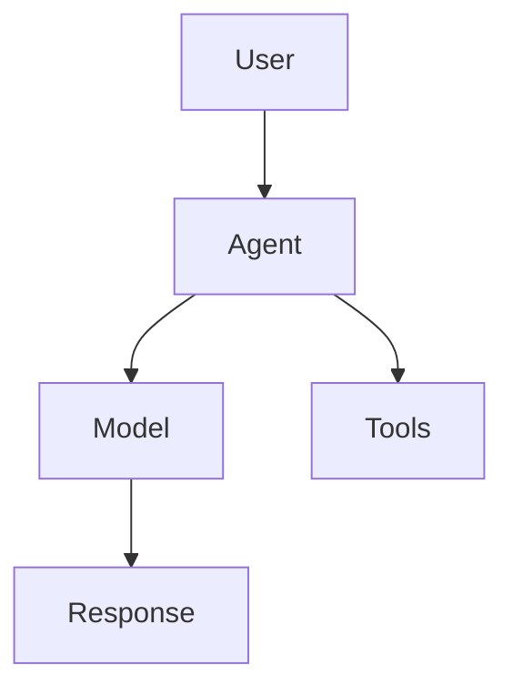

# Buddy AI Documentation

This directory contains the comprehensive documentation for Buddy AI, built with MkDocs Material.

## 📚 Documentation Structure

```
docs/
├── index.md                    # Homepage
├── getting-started/            # Installation & quick start
│   ├── installation.md
│   ├── quickstart.md
│   ├── configuration.md
│   └── examples.md
├── core/                       # Core concepts
│   ├── agents.md
│   ├── models.md
│   ├── memory.md
│   ├── tools.md
│   └── knowledge.md
├── agents/                     # Agent framework
│   ├── agent-class.md
│   ├── configuration.md
│   ├── lifecycle.md
│   ├── metrics.md
│   ├── evolution.md
│   └── personality.md
├── models/                     # Model providers
│   ├── overview.md
│   ├── openai.md
│   ├── anthropic.md
│   ├── google.md
│   ├── aws.md
│   ├── azure.md
│   └── custom.md
├── tools/                      # Tools & functions
│   ├── overview.md
│   ├── builtin.md
│   ├── custom.md
│   ├── functions.md
│   └── execution.md
├── memory/                     # Memory system
│   ├── overview.md
│   ├── agent-memory.md
│   ├── sessions.md
│   ├── user-memories.md
│   └── storage.md
├── knowledge/                  # Knowledge management
│   ├── overview.md
│   ├── documents.md
│   ├── vectordb.md
│   ├── rag.md
│   └── sources.md
├── team/                      # Team collaboration
│   ├── overview.md
│   ├── multi-agent.md
│   ├── orchestration.md
│   └── communication.md
├── workflows/                 # Workflow system
│   ├── overview.md
│   ├── definition.md
│   ├── execution.md
│   └── templates.md
├── advanced/                  # Advanced features
│   ├── multimodal.md
│   ├── reasoning.md
│   ├── planning.md
│   ├── security.md
│   └── evaluation.md
├── training/                  # Training & fine-tuning
│   ├── overview.md
│   ├── data-prep.md
│   ├── training.md
│   └── evaluation.md
├── deployment/                # Deployment options
│   ├── overview.md
│   ├── fastapi.md
│   ├── docker.md
│   ├── kubernetes.md
│   └── cloud.md
├── cli/                      # CLI reference
│   ├── overview.md
│   ├── workspace.md
│   ├── agents.md
│   ├── training.md
│   └── configuration.md
├── api/                      # API reference
│   ├── overview.md
│   ├── agent-api.md
│   ├── team-api.md
│   ├── knowledge-api.md
│   └── workflow-api.md
├── examples/                 # Examples & tutorials
│   ├── basic.md
│   ├── advanced.md
│   ├── use-cases.md
│   └── integrations.md
└── troubleshooting/          # Troubleshooting
    ├── common-issues.md
    ├── debugging.md
    ├── performance.md
    └── faq.md
```

## 🚀 Local Development

### Prerequisites

- Python 3.10+
- pip

### Setup

1. **Install dependencies:**
   ```bash
   pip install -r docs-requirements.txt
   ```

2. **Serve locally:**
   ```bash
   mkdocs serve
   ```

3. **Open in browser:**
   ```
   http://127.0.0.1:8000
   ```

### Building

Build static site:
```bash
mkdocs build
```

Output will be in `site/` directory.

## 🌐 Deployment

### GitHub Pages (Automatic)

The documentation is automatically deployed to GitHub Pages via GitHub Actions when changes are pushed to the main branch.

**Setup Steps:**

1. **Enable GitHub Pages** in repository settings
2. **Set source** to "GitHub Actions"
3. **Push changes** to main branch

The documentation will be available at:
```
https://esasrir91.github.io/buddy-ai/
```

### Manual Deployment

Deploy to GitHub Pages manually:
```bash
mkdocs gh-deploy
```

### Custom Domain

To use a custom domain:

1. **Add CNAME file:**
   ```bash
   echo "docs.buddy-ai.com" > docs/CNAME
   ```

2. **Configure DNS** to point to GitHub Pages

3. **Update mkdocs.yml:**
   ```yaml
   site_url: https://docs.buddy-ai.com
   ```

## ✏️ Contributing

### Writing Guidelines

1. **Use clear, concise language**
2. **Include code examples** for all concepts
3. **Add type hints** to code samples
4. **Use admonitions** for important notes:
   ```markdown
   !!! warning "Important"
       This is a warning message.
   
   !!! tip "Pro Tip"
       This is helpful advice.
   
   !!! example "Example"
       This shows how to use the feature.
   ```

5. **Cross-reference** related sections:
   ```markdown
   See the [Agent Configuration](../agents/configuration.md) guide.
   ```

### Code Examples

**Python code blocks:**
```markdown
```python
from buddy import Agent
from buddy.models.openai import OpenAIChat

agent = Agent(model=OpenAIChat())
response = agent.run("Hello!")
```
```

**Bash commands:**
```markdown
```bash
pip install buddy-ai[all]
```
```

**Configuration files:**
```markdown
```yaml
# mkdocs.yml
site_name: My Documentation
```
```

### Adding New Pages

1. **Create the markdown file** in appropriate directory
2. **Add to navigation** in `mkdocs.yml`:
   ```yaml
   nav:
     - New Section:
       - New Page: section/new-page.md
   ```
3. **Test locally** with `mkdocs serve`
4. **Commit and push** changes

### Diagrams

Use Mermaid for diagrams:

```markdown

```

## 🔧 Configuration

### MkDocs Configuration

The main configuration is in `mkdocs.yml`:

```yaml
site_name: Buddy AI Documentation
site_url: https://esasrir91.github.io/buddy-ai/
theme:
  name: material
  palette:
    - scheme: default
      primary: blue
      accent: light blue
```

### Theme Customization

The Material theme provides:
- **Dark/light mode** toggle
- **Search functionality**
- **Navigation tabs**
- **Code highlighting**
- **Mobile responsive** design

### Plugins

Active plugins:
- **search**: Full-text search
- **mkdocstrings**: API documentation from docstrings
- **mermaid**: Diagram support

## 📊 Analytics

### GitHub Pages Analytics

GitHub provides basic analytics for Pages sites. For detailed analytics, consider:

- **Google Analytics**
- **Plausible Analytics**
- **GitHub Insights**

### Adding Google Analytics

Add to `mkdocs.yml`:
```yaml
extra:
  analytics:
    provider: google
    property: G-XXXXXXXXXX
```

## 🚨 Troubleshooting

### Common Issues

**MkDocs not found:**
```bash
pip install mkdocs mkdocs-material
```

**Plugin errors:**
```bash
pip install mkdocstrings[python] pymdown-extensions
```

**Build failures:**
- Check `mkdocs.yml` syntax
- Verify all referenced files exist
- Check for broken internal links

**GitHub Actions deployment fails:**
- Verify repository settings
- Check workflow permissions
- Review action logs

### Getting Help

- **MkDocs Documentation**: https://www.mkdocs.org/
- **Material Theme**: https://squidfunk.github.io/mkdocs-material/
- **GitHub Issues**: For Buddy AI specific documentation issues

## 📝 TODO

### Planned Improvements

- [ ] **API Reference** - Auto-generated from docstrings
- [ ] **Interactive Examples** - Code playground integration  
- [ ] **Video Tutorials** - Embedded video content
- [ ] **Multi-language** - Documentation translations
- [ ] **Version Support** - Multiple version documentation
- [ ] **Search Enhancement** - Advanced search features
- [ ] **Performance** - Optimize build and load times

### Content Gaps

- [ ] Complete all module documentation
- [ ] Add more advanced examples
- [ ] Create troubleshooting guides
- [ ] Add performance optimization tips
- [ ] Write deployment best practices
- [ ] Create tutorial series

---

## 📞 Support

For documentation-related questions:
- **GitHub Issues**: [buddy-ai/issues](https://github.com/esasrir91/buddy-ai/issues)
- **Discussions**: [buddy-ai/discussions](https://github.com/esasrir91/buddy-ai/discussions)

For general Buddy AI support:
- **Documentation**: https://esasrir91.github.io/buddy-ai/
- **PyPI**: https://pypi.org/project/buddy-ai/
- **Repository**: https://github.com/esasrir91/buddy-ai