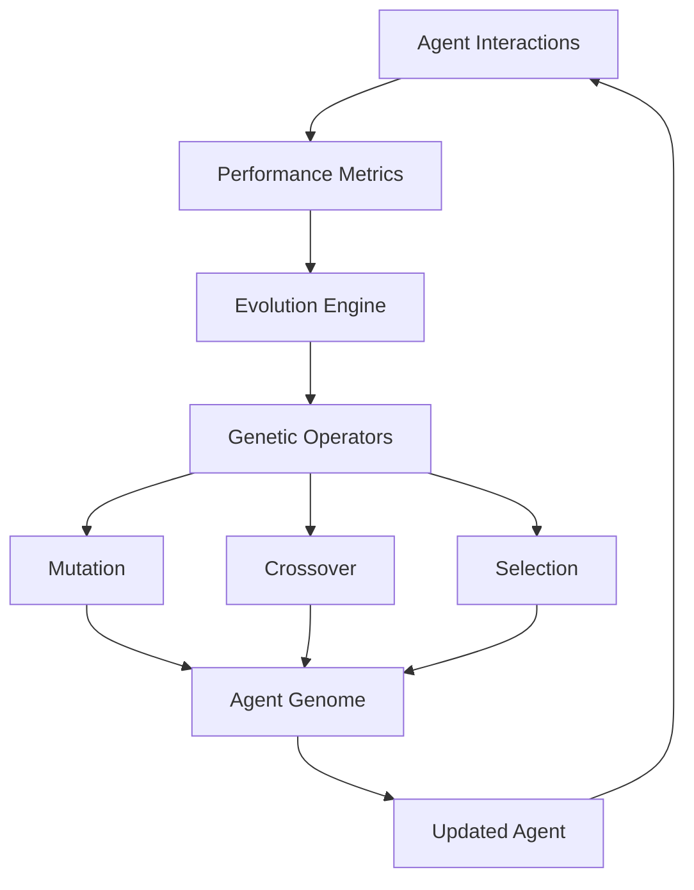

# Agent Evolution System

Buddy AI's evolutionary agent system enables agents to self-improve through experience, learning from interactions, and adapting their behavior to become more effective over time.

## 🧬 Evolution Overview

The Agent Evolution system implements principles inspired by biological evolution and machine learning to create agents that continuously improve their performance through:

- **Experience-Based Learning**: Learning from successful and failed interactions
- **Behavior Adaptation**: Adjusting communication style and approach
- **Skill Development**: Acquiring new capabilities over time  
- **Performance Optimization**: Improving response quality and efficiency
- **Environment Adaptation**: Adapting to different contexts and users



## 🚀 Quick Start

### Basic Evolution Setup
```python
from buddy import Agent
from buddy.models.openai import OpenAIChat
from buddy.agent.evolution import EvolutionaryMixin

# Create evolving agent
agent = Agent(
    name="EvolvingBot",
    model=OpenAIChat(),
    instructions="You are a helpful assistant that learns from experience.",
    evolution=True,  # Enable evolution
    evolution_config={
        "learning_rate": 0.1,
        "adaptation_threshold": 0.7,
        "mutation_rate": 0.05,
        "memory_influence": 0.3
    }
)

# Agent automatically evolves through interactions
for i in range(100):
    response = agent.run(f"Question {i}: How can I improve my productivity?")
    
    # Provide feedback (optional but improves evolution)
    agent.provide_feedback(
        response_id=response.run_id,
        rating=user_rating,  # 1-5 scale
        feedback_text="This was helpful because..."
    )

# Check evolution progress
evolution_stats = agent.get_evolution_statistics()
print(f"Improvement over time: {evolution_stats['performance_trend']}")
```

## 🧬 Evolution Components

### AgentGenome
The genetic representation of an agent's characteristics.

```python
from buddy.agent.evolution import AgentGenome

# Create agent genome
genome = AgentGenome(
    personality_traits={
        "helpfulness": 0.8,
        "creativity": 0.6,
        "formality": 0.4,
        "empathy": 0.9,
        "precision": 0.7
    },
    behavioral_patterns={
        "response_length": "medium",  # short, medium, long
        "example_usage": "frequent",  # rare, occasional, frequent
        "question_asking": 0.3,      # 0-1 tendency to ask clarifying questions
        "proactivity": 0.5           # 0-1 tendency to provide additional info
    },
    skill_levels={
        "technical_explanation": 0.8,
        "creative_writing": 0.6,
        "data_analysis": 0.9,
        "customer_service": 0.7,
        "problem_solving": 0.8
    },
    adaptation_parameters={
        "context_sensitivity": 0.7,
        "user_preference_learning": 0.8,
        "error_correction_rate": 0.6,
        "knowledge_integration": 0.9
    }
)

# Apply genome to agent
agent.apply_genome(genome)
```

### EvolutionStrategy
Defines how agents evolve and improve.

```python
from buddy.agent.evolution import EvolutionStrategy

# Configure evolution strategy
strategy = EvolutionStrategy(
    algorithm="genetic_algorithm",  # or "reinforcement_learning", "hybrid"
    
    # Genetic Algorithm Parameters
    population_size=10,
    mutation_rate=0.05,
    crossover_rate=0.7,
    selection_method="tournament",  # or "roulette", "rank"
    elitism_rate=0.1,
    
    # Learning Parameters
    learning_rate=0.01,
    discount_factor=0.95,
    exploration_rate=0.1,
    
    # Adaptation Triggers
    adaptation_frequency=50,  # Evolve every N interactions
    performance_threshold=0.1,  # Minimum improvement required
    
    # Fitness Criteria
    fitness_weights={
        "user_satisfaction": 0.4,
        "response_accuracy": 0.3,
        "efficiency": 0.2,
        "engagement": 0.1
    }
)

agent.set_evolution_strategy(strategy)
```

### FitnessEvaluator
Measures agent performance for evolution guidance.

```python
from buddy.agent.evolution import FitnessEvaluator

class CustomFitnessEvaluator(FitnessEvaluator):
    def evaluate_response(self, response, context):
        \"\"\"Evaluate response quality for evolution.\"\"\"
        
        fitness_score = 0.0
        
        # User satisfaction (from feedback)
        if context.get("user_rating"):
            fitness_score += context["user_rating"] / 5.0 * 0.4
        
        # Response relevance
        relevance_score = self.calculate_relevance(
            response.content, 
            context["original_query"]
        )
        fitness_score += relevance_score * 0.3
        
        # Efficiency (response time)
        time_score = min(1.0, 10.0 / response.response_time)
        fitness_score += time_score * 0.2
        
        # Tool usage appropriateness
        tool_score = self.evaluate_tool_usage(response.tool_calls, context)
        fitness_score += tool_score * 0.1
        
        return fitness_score
    
    def calculate_relevance(self, response, query):
        # Implement relevance calculation logic
        # Could use semantic similarity, keyword matching, etc.
        pass
    
    def evaluate_tool_usage(self, tool_calls, context):
        # Evaluate if tools were used appropriately
        pass

# Use custom evaluator
agent.set_fitness_evaluator(CustomFitnessEvaluator())
```

## 📈 Evolution Mechanisms

### 1. Genetic Operations

#### Mutation
Random changes to agent genome for exploration.

```python
# Configure mutation strategies
mutation_config = {
    "personality_mutation_rate": 0.03,
    "behavior_mutation_rate": 0.05,
    "skill_mutation_rate": 0.02,
    "mutation_strength": 0.1,  # How much to change values
    "adaptive_mutation": True,  # Adjust rate based on performance
}

agent.configure_mutation(mutation_config)
```

#### Crossover
Combining traits from successful agent variants.

```python
# Crossover between high-performing agents
def crossover_agents(agent1, agent2):
    \"\"\"Create new agent by combining traits from two successful agents.\"\"\"
    
    # Get genomes
    genome1 = agent1.get_genome()
    genome2 = agent2.get_genome()
    
    # Combine traits (example: average)
    new_genome = AgentGenome()
    
    for trait, value1 in genome1.personality_traits.items():
        value2 = genome2.personality_traits.get(trait, value1)
        new_genome.personality_traits[trait] = (value1 + value2) / 2
    
    # Apply to new agent
    new_agent = Agent(model=OpenAIChat())
    new_agent.apply_genome(new_genome)
    
    return new_agent

# Use crossover
if agent.performance_score > 0.8:
    evolved_agent = crossover_agents(agent, best_performing_agent)
```

#### Selection
Choosing which agent variants survive and reproduce.

```python
from buddy.agent.evolution import SelectionMethods

# Tournament selection
selector = SelectionMethods.tournament_selection(
    tournament_size=3,
    pressure=0.8  # Selection pressure
)

# Roulette wheel selection
selector = SelectionMethods.roulette_selection(
    fitness_scaling="linear"  # or "exponential"
)

# Rank-based selection
selector = SelectionMethods.rank_selection(
    selective_pressure=1.5
)

agent.set_selection_method(selector)
```

### 2. Reinforcement Learning

#### Q-Learning Integration
```python
# Configure Q-learning for behavior optimization
rl_config = {
    "algorithm": "q_learning",
    "learning_rate": 0.1,
    "discount_factor": 0.95,
    "exploration_rate": 0.1,
    "exploration_decay": 0.995,
    "min_exploration_rate": 0.01,
    
    # State representation
    "state_features": [
        "user_sentiment",
        "query_complexity", 
        "context_length",
        "available_tools",
        "knowledge_availability"
    ],
    
    # Action space
    "actions": [
        "detailed_response",
        "concise_response",
        "ask_clarification",
        "use_tools",
        "search_knowledge",
        "request_feedback"
    ]
}

agent.configure_reinforcement_learning(rl_config)
```

#### Policy Gradient Methods
```python
# Configure policy gradient learning
pg_config = {
    "algorithm": "policy_gradient",
    "learning_rate": 0.01,
    "baseline": "value_function",
    "entropy_coefficient": 0.01,
    
    # Network architecture
    "hidden_layers": [128, 64],
    "activation": "relu",
    "optimizer": "adam"
}

agent.configure_policy_learning(pg_config)
```

### 3. Meta-Learning
Learning how to learn more effectively.

```python
# Configure meta-learning
meta_config = {
    "adaptation_steps": 5,
    "meta_learning_rate": 0.001,
    "task_distribution": "few_shot_qa",
    
    # MAML (Model-Agnostic Meta-Learning) settings
    "inner_loop_steps": 3,
    "outer_loop_lr": 0.001,
    
    # Memory-based meta-learning
    "memory_size": 1000,
    "memory_key_size": 64,
    "memory_value_size": 128
}

agent.configure_meta_learning(meta_config)
```

## 🎯 Performance Metrics

### Evolution Tracking
```python
# Get detailed evolution statistics
evolution_stats = agent.get_evolution_statistics()

print(f"Generation: {evolution_stats['generation']}")
print(f"Fitness score: {evolution_stats['current_fitness']:.3f}")
print(f"Best fitness: {evolution_stats['best_fitness']:.3f}")
print(f"Average fitness: {evolution_stats['avg_fitness']:.3f}")
print(f"Improvement rate: {evolution_stats['improvement_rate']:.3f}")

# Performance trends
trends = evolution_stats['performance_trends']
print(f"User satisfaction trend: {trends['satisfaction_trend']}")
print(f"Response quality trend: {trends['quality_trend']}")
print(f"Efficiency trend: {trends['efficiency_trend']}")
```

### Adaptation Metrics
```python
# Track adaptation to different contexts
adaptation_metrics = agent.get_adaptation_metrics()

print(f"Context adaptations: {adaptation_metrics['context_adaptations']}")
print(f"User-specific learning: {adaptation_metrics['user_learning']}")
print(f"Skill improvements: {adaptation_metrics['skill_improvements']}")
```

### Learning Curves
```python
# Visualize learning progress
import matplotlib.pyplot as plt

learning_data = agent.get_learning_history()

plt.figure(figsize=(12, 8))
plt.subplot(2, 2, 1)
plt.plot(learning_data['interactions'], learning_data['fitness_scores'])
plt.title('Fitness Score Over Time')

plt.subplot(2, 2, 2)
plt.plot(learning_data['interactions'], learning_data['user_ratings'])
plt.title('User Satisfaction Over Time')

plt.subplot(2, 2, 3)
plt.plot(learning_data['interactions'], learning_data['response_times'])
plt.title('Response Efficiency Over Time')

plt.subplot(2, 2, 4)
plt.plot(learning_data['interactions'], learning_data['accuracy_scores'])
plt.title('Accuracy Over Time')

plt.tight_layout()
plt.show()
```

## 🔧 Advanced Evolution Features

### Multi-Objective Optimization
```python
# Optimize for multiple objectives simultaneously
objectives = {
    "accuracy": {"weight": 0.4, "target": 0.9},
    "speed": {"weight": 0.3, "target": 2.0},  # max 2 seconds
    "user_satisfaction": {"weight": 0.3, "target": 4.5}  # out of 5
}

agent.configure_multi_objective_evolution(
    objectives=objectives,
    method="pareto_dominance",  # or "weighted_sum", "lexicographic"
    archive_size=100  # Size of Pareto front archive
)
```

### Novelty Search
```python
# Encourage exploration of novel behaviors
novelty_config = {
    "enable_novelty_search": True,
    "novelty_threshold": 0.5,
    "behavior_descriptor": [
        "response_creativity",
        "interaction_pattern",
        "tool_usage_style"
    ],
    "archive_size": 200,
    "k_nearest": 15
}

agent.configure_novelty_search(novelty_config)
```

### Coevolution
```python
# Evolve multiple agents together
from buddy.agent.evolution import CoevolutionManager

# Create multiple agents
agents = [
    Agent(name=f"Agent_{i}", model=OpenAIChat(), evolution=True)
    for i in range(5)
]

# Setup coevolution
coevolution = CoevolutionManager(
    agents=agents,
    competition_strategy="round_robin",  # or "tournament", "cooperative"
    cooperation_reward=0.2,
    competition_pressure=0.8
)

# Evolve together
coevolution.evolve_generation()

# Get best performing agent
best_agent = coevolution.get_best_agent()
```

### Transfer Learning
```python
# Transfer learned behaviors between agents
def transfer_knowledge(source_agent, target_agent, transfer_ratio=0.3):
    \"\"\"Transfer successful behaviors from source to target agent.\"\"\"
    
    source_genome = source_agent.get_genome()
    target_genome = target_agent.get_genome()
    
    # Transfer personality traits
    for trait, source_value in source_genome.personality_traits.items():
        target_value = target_genome.personality_traits.get(trait, 0.5)
        new_value = (1 - transfer_ratio) * target_value + transfer_ratio * source_value
        target_genome.personality_traits[trait] = new_value
    
    # Transfer learned skills
    for skill, source_level in source_genome.skill_levels.items():
        if source_level > target_genome.skill_levels.get(skill, 0):
            boost = (source_level - target_genome.skill_levels.get(skill, 0)) * transfer_ratio
            target_genome.skill_levels[skill] = min(1.0, 
                target_genome.skill_levels.get(skill, 0) + boost
            )
    
    target_agent.apply_genome(target_genome)

# Use transfer learning
if expert_agent.performance_score > 0.9:
    transfer_knowledge(expert_agent, new_agent, transfer_ratio=0.4)
```

## 🎛️ Evolution Configuration

### Adaptive Parameters
```python
# Configure adaptive evolution parameters
adaptive_config = {
    "adaptive_mutation_rate": True,
    "performance_based_adaptation": True,
    "context_sensitive_evolution": True,
    
    # Adaptation triggers
    "stagnation_threshold": 10,  # generations without improvement
    "diversity_threshold": 0.1,  # minimum population diversity
    
    # Parameter ranges
    "mutation_rate_range": (0.01, 0.1),
    "learning_rate_range": (0.001, 0.1),
    "exploration_rate_range": (0.05, 0.3)
}

agent.configure_adaptive_evolution(adaptive_config)
```

### Custom Evolution Hooks
```python
# Add custom evolution callbacks
def on_mutation(agent, old_genome, new_genome):
    \"\"\"Called when agent undergoes mutation.\"\"\"
    print(f"Agent {agent.name} mutated")
    log_genome_changes(old_genome, new_genome)

def on_generation_complete(generation, population_stats):
    \"\"\"Called at end of each generation.\"\"\"
    print(f"Generation {generation} complete")
    print(f"Best fitness: {population_stats['best_fitness']}")
    save_generation_data(generation, population_stats)

def on_adaptation(agent, context, adaptation_type):
    \"\"\"Called when agent adapts to new context.\"\"\"
    print(f"Agent adapted to {context} via {adaptation_type}")

# Register callbacks
agent.register_evolution_callback("mutation", on_mutation)
agent.register_evolution_callback("generation_complete", on_generation_complete)
agent.register_evolution_callback("adaptation", on_adaptation)
```

## 🚀 Evolution Strategies

### Steady-State Evolution
```python
# Continuous evolution during operation
steady_state_config = {
    "enable_steady_state": True,
    "evaluation_window": 20,  # evaluate every N interactions
    "replacement_rate": 0.1,  # replace 10% of worst performers
    "continuous_learning": True
}

agent.configure_steady_state_evolution(steady_state_config)
```

### Staged Evolution
```python
# Evolution in distinct phases
stages = [
    {
        "name": "exploration_stage",
        "duration": 100,  # interactions
        "mutation_rate": 0.1,
        "exploration_rate": 0.3,
        "focus": ["personality_traits", "behavioral_patterns"]
    },
    {
        "name": "refinement_stage", 
        "duration": 200,
        "mutation_rate": 0.03,
        "exploration_rate": 0.1,
        "focus": ["skill_levels", "adaptation_parameters"]
    },
    {
        "name": "optimization_stage",
        "duration": 300,
        "mutation_rate": 0.01,
        "exploration_rate": 0.05,
        "focus": ["efficiency", "specialization"]
    }
]

agent.configure_staged_evolution(stages)
```

## 📊 Evolution Analytics

### Performance Analysis
```python
# Comprehensive evolution analysis
analysis = agent.analyze_evolution()

print("Evolution Summary:")
print(f"Total generations: {analysis['total_generations']}")
print(f"Total improvements: {analysis['improvement_count']}")
print(f"Success rate: {analysis['success_rate']:.2%}")

print("\\nBest Traits:")
for trait, value in analysis['best_traits'].items():
    print(f"  {trait}: {value:.3f}")

print("\\nEvolution Patterns:")
for pattern in analysis['evolution_patterns']:
    print(f"  - {pattern}")
```

### Comparative Analysis
```python
# Compare evolution across different configurations
configs = [
    {"mutation_rate": 0.01, "learning_rate": 0.1},
    {"mutation_rate": 0.05, "learning_rate": 0.05},
    {"mutation_rate": 0.1, "learning_rate": 0.01}
]

results = []
for config in configs:
    agent = Agent(model=OpenAIChat(), evolution=True, evolution_config=config)
    
    # Run evolution experiment
    for i in range(200):
        agent.run(f"Test query {i}")
    
    results.append(agent.get_evolution_statistics())

# Analyze results
best_config = max(results, key=lambda x: x['best_fitness'])
print(f"Best configuration: {best_config}")
```

## 🎯 Best Practices

### Evolution Guidelines
1. **Start Simple**: Begin with basic evolution, add complexity gradually
2. **Monitor Performance**: Track metrics to ensure evolution is beneficial
3. **Balance Exploration/Exploitation**: Adjust rates based on performance
4. **Use Domain Knowledge**: Incorporate task-specific fitness functions
5. **Validate Improvements**: Test evolved agents on held-out data

### Common Pitfalls
```python
# Avoid overfitting to recent interactions
evolution_config = {
    "fitness_history_window": 100,  # Use longer history
    "regularization_weight": 0.1,   # Prevent overfitting
    "diversity_preservation": True   # Maintain genetic diversity
}

# Prevent premature convergence
diversity_config = {
    "minimum_diversity": 0.1,
    "diversity_measure": "genotype",  # or "phenotype", "behavioral"
    "niching_method": "fitness_sharing",
    "niche_radius": 0.1
}

agent.configure_evolution(evolution_config)
agent.configure_diversity_preservation(diversity_config)
```

The Agent Evolution system provides a powerful framework for creating AI agents that continuously improve through experience, adapting to their environment and becoming more effective over time.