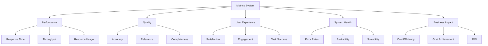

# Agent Metrics and Analytics

Buddy AI's comprehensive metrics system provides detailed insights into agent performance, user satisfaction, system efficiency, and behavioral patterns.

## 📊 Metrics Overview

The metrics system tracks multiple dimensions of agent performance to enable optimization, debugging, and quality assurance:

- **Performance Metrics**: Response time, throughput, resource utilization
- **Quality Metrics**: Accuracy, completeness, relevance, coherence
- **User Experience**: Satisfaction scores, engagement levels, task success
- **System Health**: Error rates, availability, scalability metrics
- **Business Impact**: Cost efficiency, goal achievement, ROI



## 🚀 Quick Start

### Basic Metrics Collection
```python
from buddy import Agent
from buddy.models.openai import OpenAIChat
from buddy.eval.metrics import MetricsCollector

# Create agent with metrics
agent = Agent(
    model=OpenAIChat(),
    metrics_collector=MetricsCollector(
        track_performance=True,
        track_quality=True,
        track_user_experience=True,
        storage_backend="local"  # or "prometheus", "influxdb", "cloudwatch"
    )
)

# Run tasks - metrics are automatically collected
result = agent.run("Analyze this quarterly report")

# View metrics
metrics = agent.get_metrics_summary()
print(f"Response Time: {metrics['performance']['avg_response_time']:.2f}s")
print(f"Quality Score: {metrics['quality']['overall_score']:.2f}")
print(f"User Satisfaction: {metrics['user_experience']['satisfaction']:.2f}")
```

### Real-time Monitoring
```python
from buddy.eval.metrics import MetricsDashboard

# Start real-time dashboard
dashboard = MetricsDashboard(
    agents=[agent],
    update_interval=5,  # seconds
    web_interface=True,
    port=8080
)

dashboard.start()
# Dashboard available at http://localhost:8080
```

## 📈 Performance Metrics

### Response Time Tracking
```python
from buddy.eval.performance import ResponseTimeTracker

response_tracker = ResponseTimeTracker(
    percentiles=[50, 90, 95, 99],  # Track specific percentiles
    time_windows=["1m", "5m", "1h", "24h"],  # Different time windows
    breakdown_by=["model", "task_type", "user_type"]  # Segmentation
)

agent.add_metric_tracker(response_tracker)

# Analyze response times
performance_report = response_tracker.generate_report()
print("Response Time Analysis:")
print(f"  P50: {performance_report['p50']:.3f}s")
print(f"  P90: {performance_report['p90']:.3f}s") 
print(f"  P95: {performance_report['p95']:.3f}s")
print(f"  P99: {performance_report['p99']:.3f}s")

# Breakdown by model
for model, times in performance_report['by_model'].items():
    print(f"  {model}: {times['avg']:.3f}s (avg)")
```

### Throughput Analysis
```python
from buddy.eval.performance import ThroughputAnalyzer

throughput_analyzer = ThroughputAnalyzer(
    time_windows=["1m", "5m", "15m", "1h"],
    track_concurrent_requests=True,
    track_queue_depth=True
)

agent.add_metric_tracker(throughput_analyzer)

# Monitor throughput
throughput_data = throughput_analyzer.get_current_stats()
print(f"Requests/minute: {throughput_data['rpm']:.1f}")
print(f"Requests/hour: {throughput_data['rph']:.1f}")
print(f"Concurrent requests: {throughput_data['concurrent']}")
print(f"Queue depth: {throughput_data['queue_depth']}")
```

### Resource Utilization
```python
from buddy.eval.performance import ResourceMonitor

resource_monitor = ResourceMonitor(
    track_memory=True,
    track_cpu=True,
    track_gpu=True,
    track_network=True,
    track_storage=True,
    alert_thresholds={
        "memory_usage": 0.8,    # 80%
        "cpu_usage": 0.7,       # 70% 
        "gpu_memory": 0.9,      # 90%
        "disk_space": 0.8       # 80%
    }
)

agent.add_metric_tracker(resource_monitor)

# Check resource usage
resources = resource_monitor.get_current_usage()
print(f"Memory: {resources['memory']['used_gb']:.1f}GB / {resources['memory']['total_gb']:.1f}GB")
print(f"CPU: {resources['cpu']['usage_percent']:.1f}%")
print(f"GPU Memory: {resources['gpu']['memory_used_gb']:.1f}GB")
```

## 🎯 Quality Metrics

### Accuracy Assessment
```python
from buddy.eval.accuracy import AccuracyEvaluator

accuracy_evaluator = AccuracyEvaluator(
    evaluation_methods=[
        "ground_truth_comparison",
        "expert_human_review", 
        "automated_fact_checking",
        "consistency_validation",
        "benchmark_comparison"
    ],
    quality_dimensions=[
        "factual_correctness",
        "logical_consistency", 
        "completeness",
        "relevance",
        "clarity"
    ]
)

agent.add_metric_tracker(accuracy_evaluator)

# Evaluate response quality
response = agent.run("What are the benefits of renewable energy?")
quality_scores = accuracy_evaluator.evaluate_response(
    response=response,
    ground_truth=None,  # If available
    context={"topic": "renewable_energy", "user_level": "general"}
)

print("Quality Assessment:")
for dimension, score in quality_scores.items():
    print(f"  {dimension}: {score:.3f}")

print(f"Overall Quality Score: {quality_scores['overall']:.3f}")
```

### Relevance Scoring
```python
from buddy.eval.accuracy import RelevanceScorer

relevance_scorer = RelevanceScorer(
    scoring_methods=[
        "semantic_similarity",
        "keyword_matching",
        "intent_alignment",
        "context_appropriateness"
    ],
    relevance_factors={
        "query_answer_alignment": 0.4,
        "context_utilization": 0.3,
        "user_intent_fulfillment": 0.3
    }
)

# Score relevance
relevance_score = relevance_scorer.score_relevance(
    query="How do I optimize database performance?",
    response=response,
    context={"user_expertise": "intermediate", "database_type": "postgresql"}
)

print(f"Relevance Score: {relevance_score['overall']:.3f}")
print("Component Scores:")
for component, score in relevance_score['components'].items():
    print(f"  {component}: {score:.3f}")
```

### Completeness Analysis
```python
from buddy.eval.accuracy import CompletenessAnalyzer

completeness_analyzer = CompletenessAnalyzer(
    completeness_criteria=[
        "all_aspects_covered",
        "sufficient_detail",
        "practical_examples",
        "actionable_steps",
        "edge_cases_addressed"
    ]
)

# Analyze completeness
completeness_score = completeness_analyzer.analyze_completeness(
    query="Explain machine learning algorithms",
    response=response,
    expected_aspects=[
        "supervised_learning",
        "unsupervised_learning", 
        "reinforcement_learning",
        "algorithm_examples",
        "use_cases",
        "advantages_disadvantages"
    ]
)

print(f"Completeness Score: {completeness_score['overall']:.3f}")
print("Missing Aspects:")
for aspect in completeness_score['missing_aspects']:
    print(f"  - {aspect}")
```

## 😊 User Experience Metrics

### Satisfaction Tracking
```python
from buddy.eval.metrics import SatisfactionTracker

satisfaction_tracker = SatisfactionTracker(
    collection_methods=[
        "explicit_feedback",     # Direct user ratings
        "implicit_signals",      # Behavioral indicators
        "follow_up_questions",   # Need for clarification
        "task_completion_rate"   # Success in achieving goals
    ],
    satisfaction_dimensions=[
        "helpfulness",
        "clarity", 
        "completeness",
        "timeliness",
        "appropriateness"
    ]
)

agent.add_metric_tracker(satisfaction_tracker)

# Collect satisfaction feedback
satisfaction_tracker.record_explicit_feedback(
    interaction_id="12345",
    ratings={
        "helpfulness": 4.5,
        "clarity": 4.0,
        "completeness": 3.5,
        "timeliness": 5.0,
        "appropriateness": 4.0
    },
    overall_rating=4.2,
    comments="Very helpful response, could use more examples"
)

# Analyze satisfaction trends
satisfaction_report = satisfaction_tracker.generate_report(timeframe="last_7_days")
print(f"Average Satisfaction: {satisfaction_report['avg_overall']:.2f}")
print("Dimension Breakdown:")
for dimension, score in satisfaction_report['by_dimension'].items():
    print(f"  {dimension}: {score:.2f}")
```

### Engagement Analysis
```python
from buddy.eval.metrics import EngagementAnalyzer

engagement_analyzer = EngagementAnalyzer(
    engagement_indicators=[
        "session_duration",
        "messages_per_session",
        "return_visits",
        "feature_usage_depth",
        "proactive_questions",
        "task_completion_rate"
    ],
    user_segmentation=[
        "new_users",
        "regular_users", 
        "power_users",
        "enterprise_users"
    ]
)

# Track engagement metrics
engagement_data = engagement_analyzer.get_engagement_metrics()
print("Engagement Analysis:")
print(f"  Avg Session Duration: {engagement_data['avg_session_duration']:.1f} minutes")
print(f"  Messages per Session: {engagement_data['avg_messages_per_session']:.1f}")
print(f"  Return Rate: {engagement_data['return_rate']:.1%}")
print(f"  Feature Adoption: {engagement_data['feature_adoption_rate']:.1%}")

# Segment analysis
for segment, metrics in engagement_data['by_segment'].items():
    print(f"\\n{segment}:")
    print(f"  Sessions: {metrics['session_count']}")
    print(f"  Avg Duration: {metrics['avg_duration']:.1f} min")
    print(f"  Satisfaction: {metrics['avg_satisfaction']:.2f}")
```

### Task Success Rate
```python
from buddy.eval.metrics import TaskSuccessTracker

task_success_tracker = TaskSuccessTracker(
    success_criteria={
        "information_retrieval": {
            "relevant_info_provided": 0.8,
            "user_confirms_helpfulness": 0.7
        },
        "problem_solving": {
            "solution_provided": 1.0,
            "solution_works": 0.9,
            "user_satisfaction": 0.8
        },
        "creative_tasks": {
            "output_generated": 1.0,
            "meets_requirements": 0.8,
            "user_approval": 0.7
        }
    }
)

# Track task success
task_result = task_success_tracker.track_task(
    task_type="problem_solving",
    task_description="Help debug Python code",
    outcome_indicators={
        "solution_provided": True,
        "solution_works": True,
        "user_satisfaction": 4.5
    }
)

print(f"Task Success: {task_result['success']}")
print(f"Success Score: {task_result['success_score']:.3f}")
print(f"Success Factors Met: {task_result['factors_met']}/{task_result['total_factors']}")
```

## 🏥 System Health Metrics

### Error Rate Monitoring
```python
from buddy.eval.reliability import ErrorMonitor

error_monitor = ErrorMonitor(
    error_categories=[
        "model_errors",
        "network_errors", 
        "timeout_errors",
        "rate_limit_errors",
        "validation_errors",
        "system_errors"
    ],
    alert_thresholds={
        "error_rate_5m": 0.05,      # 5% error rate in 5 minutes
        "error_rate_1h": 0.02,      # 2% error rate in 1 hour
        "consecutive_errors": 5      # 5 consecutive errors
    }
)

agent.add_metric_tracker(error_monitor)

# Monitor error rates
error_stats = error_monitor.get_error_statistics()
print("Error Rate Analysis:")
print(f"  Overall Error Rate: {error_stats['overall_rate']:.3%}")
print(f"  Error Rate (last 5m): {error_stats['rate_5m']:.3%}")
print(f"  Error Rate (last 1h): {error_stats['rate_1h']:.3%}")

print("\\nError Breakdown:")
for category, count in error_stats['by_category'].items():
    print(f"  {category}: {count} errors")
```

### Availability Tracking
```python
from buddy.eval.reliability import AvailabilityTracker

availability_tracker = AvailabilityTracker(
    uptime_requirements={
        "target_uptime": 0.999,     # 99.9% uptime target
        "measurement_window": "30d", # 30-day rolling window
        "downtime_threshold": 5      # seconds to consider downtime
    },
    health_checks=[
        "model_response_check",
        "api_endpoint_check",
        "database_connectivity",
        "external_service_check"
    ]
)

# Check availability
availability_stats = availability_tracker.get_availability_stats()
print("Availability Report:")
print(f"  Current Uptime: {availability_stats['current_uptime']:.4%}")
print(f"  30-day Uptime: {availability_stats['uptime_30d']:.4%}")
print(f"  Downtime (30d): {availability_stats['downtime_minutes']:.1f} minutes")
print(f"  SLA Status: {'✅ Meeting' if availability_stats['meeting_sla'] else '❌ Missing'} target")
```

## 💰 Business Impact Metrics

### Cost Analysis
```python
from buddy.eval.performance import CostAnalyzer

cost_analyzer = CostAnalyzer(
    cost_categories=[
        "model_api_calls",
        "compute_resources",
        "storage_costs",
        "bandwidth_usage",
        "external_services"
    ],
    cost_attribution={
        "by_user": True,
        "by_task_type": True,
        "by_model": True,
        "by_time_period": True
    }
)

# Analyze costs
cost_report = cost_analyzer.generate_cost_report(period="last_30_days")
print("Cost Analysis (Last 30 Days):")
print(f"  Total Cost: ${cost_report['total_cost']:.2f}")
print(f"  Cost per Request: ${cost_report['cost_per_request']:.4f}")
print(f"  Cost per User: ${cost_report['cost_per_user']:.2f}")

print("\\nCost Breakdown:")
for category, cost in cost_report['by_category'].items():
    percentage = (cost / cost_report['total_cost']) * 100
    print(f"  {category}: ${cost:.2f} ({percentage:.1f}%)")
```

### ROI Analysis
```python
from buddy.eval.performance import ROIAnalyzer

roi_analyzer = ROIAnalyzer(
    value_metrics=[
        "time_saved_per_user",
        "tasks_automated",
        "productivity_increase",
        "error_reduction",
        "customer_satisfaction_improvement"
    ],
    cost_factors=[
        "development_cost",
        "operational_cost", 
        "maintenance_cost",
        "infrastructure_cost"
    ]
)

# Calculate ROI
roi_analysis = roi_analyzer.calculate_roi(
    time_period="quarterly",
    value_assumptions={
        "hourly_wage": 50,              # $/hour
        "time_saved_per_user": 2.5,     # hours/week
        "users_count": 1000,            # active users
        "productivity_multiplier": 1.2   # 20% productivity increase
    }
)

print("ROI Analysis:")
print(f"  Total Value Generated: ${roi_analysis['total_value']:,.2f}")
print(f"  Total Costs: ${roi_analysis['total_costs']:,.2f}")
print(f"  Net Benefit: ${roi_analysis['net_benefit']:,.2f}")
print(f"  ROI: {roi_analysis['roi_percentage']:.1f}%")
print(f"  Payback Period: {roi_analysis['payback_months']:.1f} months")
```

## 📊 Advanced Analytics

### Predictive Analytics
```python
from buddy.eval.analytics import PredictiveAnalyzer

predictive_analyzer = PredictiveAnalyzer(
    models=[
        "usage_forecasting",
        "performance_prediction",
        "failure_prediction",
        "capacity_planning"
    ],
    prediction_horizons=["1d", "7d", "30d", "90d"]
)

# Generate predictions
predictions = predictive_analyzer.generate_predictions()
print("Predictive Analysis:")
print(f"  Expected Usage (7d): {predictions['usage_7d']:.0f} requests")
print(f"  Performance Trend: {predictions['performance_trend']}")
print(f"  Capacity Needed (30d): {predictions['capacity_30d']}")
print(f"  Risk Assessment: {predictions['risk_level']}")
```

### A/B Testing
```python
from buddy.eval.analytics import ABTestFramework

ab_test = ABTestFramework(
    test_name="personality_effectiveness",
    variants={
        "control": {"personality_style": "professional"},
        "variant_a": {"personality_style": "friendly"},
        "variant_b": {"personality_style": "casual"}
    },
    metrics=[
        "user_satisfaction",
        "task_completion_rate",
        "engagement_duration",
        "return_rate"
    ],
    sample_size=1000,
    confidence_level=0.95
)

# Run A/B test
test_results = ab_test.run_test(duration_days=14)
print("A/B Test Results:")
for variant, results in test_results.items():
    print(f"\\n{variant}:")
    print(f"  Satisfaction: {results['user_satisfaction']:.2f}")
    print(f"  Completion Rate: {results['task_completion_rate']:.1%}")
    print(f"  Statistical Significance: {results['significance']}")
```

### Cohort Analysis
```python
from buddy.eval.analytics import CohortAnalyzer

cohort_analyzer = CohortAnalyzer(
    cohort_definition="monthly",  # Group users by signup month
    metrics=[
        "retention_rate",
        "usage_frequency", 
        "feature_adoption",
        "satisfaction_evolution"
    ],
    analysis_period="12_months"
)

# Generate cohort analysis
cohort_analysis = cohort_analyzer.analyze_cohorts()
print("Cohort Analysis:")
print("Monthly Retention Rates:")

for month, retention in cohort_analysis['retention_by_month'].items():
    print(f"  Month {month}: {retention:.1%}")

print(f"\\nAverage 6-month Retention: {cohort_analysis['avg_6m_retention']:.1%}")
print(f"User Lifecycle Value: ${cohort_analysis['lifecycle_value']:.2f}")
```

## 📈 Custom Metrics

### Creating Custom Metrics
```python
from buddy.eval.metrics import BaseMetric

class CustomBusinessMetric(BaseMetric):
    def __init__(self, name: str):
        super().__init__(name)
        self.business_goals = []
        self.kpis = {}
    
    def add_business_goal(self, goal_name: str, target_value: float):
        \"\"\"Add business goal to track.\"\"\"
        self.business_goals.append({
            "name": goal_name,
            "target": target_value,
            "current": 0.0
        })
    
    def update_kpi(self, kpi_name: str, value: float):
        \"\"\"Update KPI value.\"\"\"
        self.kpis[kpi_name] = value
    
    def calculate_goal_achievement(self) -> Dict[str, float]:
        \"\"\"Calculate achievement percentage for each goal.\"\"\"
        achievements = {}
        for goal in self.business_goals:
            current_value = self.kpis.get(goal["name"], 0.0)
            achievement = (current_value / goal["target"]) * 100
            achievements[goal["name"]] = min(achievement, 100.0)
        return achievements
    
    def get_metric_value(self) -> Dict:
        return {
            "goals": self.business_goals,
            "kpis": self.kpis,
            "achievements": self.calculate_goal_achievement()
        }

# Use custom metric
business_metric = CustomBusinessMetric("quarterly_goals")
business_metric.add_business_goal("user_satisfaction", 4.5)
business_metric.add_business_goal("cost_per_user", 10.0)
business_metric.add_business_goal("task_success_rate", 0.95)

agent.add_metric_tracker(business_metric)
```

### Metric Aggregation
```python
from buddy.eval.metrics import MetricAggregator

metric_aggregator = MetricAggregator(
    aggregation_rules=[
        {
            "name": "overall_health_score",
            "inputs": ["performance_score", "quality_score", "satisfaction_score"],
            "weights": [0.3, 0.4, 0.3],
            "formula": "weighted_average"
        },
        {
            "name": "efficiency_index",
            "inputs": ["throughput", "cost_per_request", "error_rate"],
            "formula": "custom",
            "function": lambda t, c, e: (t / c) * (1 - e)
        }
    ]
)

# Calculate aggregated metrics
aggregated = metric_aggregator.calculate_aggregated_metrics()
print("Aggregated Metrics:")
for metric_name, value in aggregated.items():
    print(f"  {metric_name}: {value:.3f}")
```

## 🔔 Alerts and Notifications

### Metric-based Alerts
```python
from buddy.eval.metrics import AlertSystem

alert_system = AlertSystem(
    alerts=[
        {
            "name": "high_error_rate",
            "metric": "error_rate_5m", 
            "threshold": 0.05,
            "comparison": "greater_than",
            "severity": "critical",
            "notification_channels": ["email", "slack", "pagerduty"]
        },
        {
            "name": "low_satisfaction",
            "metric": "user_satisfaction",
            "threshold": 3.5,
            "comparison": "less_than",
            "severity": "warning",
            "notification_channels": ["email"]
        },
        {
            "name": "high_cost",
            "metric": "cost_per_request",
            "threshold": 0.10,
            "comparison": "greater_than",
            "severity": "warning",
            "notification_channels": ["slack"]
        }
    ],
    notification_config={
        "email": {"smtp_server": "smtp.company.com"},
        "slack": {"webhook_url": "https://hooks.slack.com/..."},
        "pagerduty": {"integration_key": "..."}
    }
)

agent.set_alert_system(alert_system)
```

## 📋 Metrics Reporting

### Automated Reports
```python
from buddy.eval.metrics import ReportGenerator

report_generator = ReportGenerator(
    reports=[
        {
            "name": "daily_performance_summary",
            "schedule": "0 9 * * *",  # Daily at 9 AM
            "metrics": ["response_time", "throughput", "error_rate"],
            "format": "html",
            "recipients": ["team@company.com"]
        },
        {
            "name": "weekly_quality_review", 
            "schedule": "0 10 * * 1",  # Monday at 10 AM
            "metrics": ["accuracy", "relevance", "completeness", "satisfaction"],
            "format": "pdf",
            "recipients": ["quality-team@company.com"]
        }
    ]
)

# Generate on-demand report
report = report_generator.generate_report(
    report_type="comprehensive_analysis",
    time_range="last_30_days",
    include_visualizations=True
)

print(f"Report generated: {report['file_path']}")
print(f"Key insights: {report['insights']}")
```

## 🎯 Best Practices

### Metrics Strategy
1. **Define Clear Objectives**: Align metrics with business goals and user needs
2. **Balance Breadth and Depth**: Track comprehensive metrics without overwhelming
3. **Actionable Insights**: Focus on metrics that drive concrete improvements
4. **Real-time Monitoring**: Enable rapid response to issues
5. **Historical Analysis**: Track trends and long-term patterns

### Performance Optimization
1. **Efficient Collection**: Minimize overhead of metrics collection
2. **Smart Sampling**: Use sampling for high-volume metrics
3. **Asynchronous Processing**: Avoid blocking operations with metrics
4. **Storage Optimization**: Use appropriate storage backends for different metrics
5. **Query Performance**: Optimize metric queries and aggregations

The metrics and analytics system provides comprehensive visibility into agent performance, enabling data-driven optimization and ensuring high-quality user experiences.