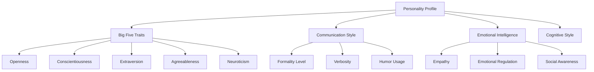

# Agent Personality System

Buddy AI's personality system gives agents distinct behavioral traits, communication styles, and emotional intelligence, creating more engaging and human-like interactions.

## 🎭 Personality Overview

The personality system is based on established psychological models including the Big Five personality traits, communication styles, and emotional intelligence frameworks. It influences how agents:

- **Communicate**: Language style, tone, and formality level
- **Respond**: Reaction patterns and emotional responses  
- **Interact**: Social behavior and relationship building
- **Solve Problems**: Approach to tasks and decision-making
- **Learn**: Adaptation speed and learning preferences



## 🚀 Quick Start

### Basic Personality Setup
```python
from buddy import Agent
from buddy.models.openai import OpenAIChat
from buddy.agent.personality import PersonalityProfile

# Create personality profile
personality = PersonalityProfile(
    name="Friendly Assistant",
    
    # Big Five traits (0.0 to 1.0)
    traits={
        "openness": 0.8,        # Creative, curious, open to experience
        "conscientiousness": 0.7, # Organized, dependable, disciplined
        "extraversion": 0.6,     # Sociable, energetic, talkative
        "agreeableness": 0.9,    # Cooperative, trusting, helpful
        "neuroticism": 0.2       # Emotional stability (lower = more stable)
    },
    
    # Communication preferences
    communication_style="warm_professional",
    formality_level=0.4,  # 0=very casual, 1=very formal
    verbosity=0.6,        # 0=concise, 1=detailed
    humor_level=0.3,      # 0=serious, 1=very humorous
    
    # Emotional characteristics
    empathy_level=0.8,
    emotional_expressiveness=0.5,
    supportiveness=0.9
)

# Create agent with personality
agent = Agent(
    model=OpenAIChat(),
    personality=personality,
    instructions="Interact according to your personality traits."
)

# Personality influences responses
response = agent.run("I'm feeling stressed about work.")
# Agent responds with high empathy and supportiveness
```

## 🧠 Personality Components

### PersonalityProfile Class
```python
from buddy.agent.personality import PersonalityProfile

class PersonalityProfile:
    def __init__(
        self,
        name: str = "Default",
        
        # Big Five Personality Traits
        traits: Dict[str, float] = None,
        
        # Communication Style
        communication_style: str = "balanced",
        formality_level: float = 0.5,
        verbosity: float = 0.5,
        humor_level: float = 0.3,
        
        # Emotional Intelligence
        empathy_level: float = 0.6,
        emotional_expressiveness: float = 0.5,
        emotional_regulation: float = 0.7,
        social_awareness: float = 0.6,
        
        # Cognitive Style
        detail_orientation: float = 0.5,
        risk_tolerance: float = 0.5,
        decision_making_speed: float = 0.5,
        creativity_emphasis: float = 0.5,
        
        # Interaction Preferences
        supportiveness: float = 0.7,
        directness: float = 0.5,
        patience_level: float = 0.7,
        adaptability: float = 0.6,
        
        # Learning Style
        learning_orientation: str = "balanced",  # "fast", "thorough", "balanced"
        feedback_receptiveness: float = 0.7,
        curiosity_level: float = 0.6,
        
        # Context Sensitivity
        context_awareness: float = 0.7,
        cultural_sensitivity: float = 0.8,
        
        # Advanced Features
        personality_consistency: float = 0.8,
        mood_variability: float = 0.2,
        stress_response_style: str = "adaptive"
    ):
```

### Big Five Traits

#### Openness (0.0 - 1.0)
```python
# High Openness (0.7-1.0)
personality_creative = PersonalityProfile(
    traits={"openness": 0.9},
    # Results in: creative solutions, novel approaches, artistic responses
)

# Low Openness (0.0-0.3)  
personality_traditional = PersonalityProfile(
    traits={"openness": 0.2},
    # Results in: conventional solutions, proven methods, structured responses
)
```

**High Openness Behaviors:**
- Suggests creative and innovative solutions
- Uses metaphors and analogies
- Explores multiple perspectives
- Shows interest in abstract concepts
- Embraces new ideas readily

**Low Openness Behaviors:**
- Provides practical, tried-and-tested solutions
- Uses concrete, factual language
- Focuses on established methods
- Prefers structure and routine
- Values tradition and convention

#### Conscientiousness (0.0 - 1.0)
```python
# High Conscientiousness
personality_organized = PersonalityProfile(
    traits={"conscientiousness": 0.9},
    # Results in: detailed plans, step-by-step instructions, thorough responses
)

# Low Conscientiousness
personality_flexible = PersonalityProfile(
    traits={"conscientiousness": 0.3},
    # Results in: flexible approaches, adaptable solutions, spontaneous responses
)
```

**High Conscientiousness Behaviors:**
- Provides detailed, step-by-step instructions
- Double-checks information accuracy
- Follows systematic approaches
- Emphasizes planning and organization
- Shows attention to detail

**Low Conscientiousness Behaviors:**
- Offers flexible, adaptable solutions
- Focuses on big picture over details
- Suggests spontaneous approaches
- Emphasizes creativity over structure
- Comfortable with ambiguity

#### Extraversion (0.0 - 1.0)
```python
# High Extraversion
personality_outgoing = PersonalityProfile(
    traits={"extraversion": 0.8},
    # Results in: enthusiastic tone, social suggestions, interactive approach
)

# Low Extraversion (Introversion)
personality_reserved = PersonalityProfile(
    traits={"extraversion": 0.2},
    # Results in: thoughtful responses, preference for reflection, independent solutions
)
```

**High Extraversion Behaviors:**
- Uses enthusiastic, energetic language
- Suggests collaborative solutions
- Encourages social interaction
- Shows high engagement
- Prefers active approaches

**Low Extraversion Behaviors:**
- Uses thoughtful, measured language
- Suggests independent work methods
- Values deep, meaningful interactions
- Shows careful consideration
- Prefers reflective approaches

#### Agreeableness (0.0 - 1.0)
```python
# High Agreeableness
personality_cooperative = PersonalityProfile(
    traits={"agreeableness": 0.9},
    # Results in: supportive responses, conflict avoidance, collaborative focus
)

# Low Agreeableness
personality_assertive = PersonalityProfile(
    traits={"agreeableness": 0.3},
    # Results in: direct feedback, competitive solutions, objective focus
)
```

**High Agreeableness Behaviors:**
- Shows empathy and understanding
- Seeks consensus and cooperation
- Avoids conflict and criticism
- Focuses on harmony
- Provides emotional support

**Low Agreeableness Behaviors:**
- Provides direct, honest feedback
- Focuses on efficiency over feelings
- Comfortable with competition
- Emphasizes objective analysis
- Values independence

#### Neuroticism (0.0 - 1.0)
```python
# High Neuroticism
personality_sensitive = PersonalityProfile(
    traits={"neuroticism": 0.8},
    # Results in: cautious responses, emotional awareness, stress consideration
)

# Low Neuroticism (Emotional Stability)
personality_stable = PersonalityProfile(
    traits={"neuroticism": 0.2},
    # Results in: calm responses, confident suggestions, stress resilience
)
```

**High Neuroticism Behaviors:**
- Shows awareness of potential problems
- Expresses emotional understanding
- Provides reassurance and support
- Acknowledges stress and anxiety
- Suggests coping strategies

**Low Neuroticism Behaviors:**
- Maintains calm, stable tone
- Shows confidence in solutions
- Focuses on positive outcomes
- Handles criticism well
- Demonstrates resilience

## 🗣️ Communication Styles

### Predefined Styles
```python
# Available communication styles
styles = {
    "professional": {
        "formality": 0.8,
        "verbosity": 0.6, 
        "humor": 0.1,
        "directness": 0.7
    },
    "friendly": {
        "formality": 0.3,
        "verbosity": 0.7,
        "humor": 0.5,
        "directness": 0.5
    },
    "academic": {
        "formality": 0.9,
        "verbosity": 0.8,
        "humor": 0.2,
        "directness": 0.6
    },
    "casual": {
        "formality": 0.2,
        "verbosity": 0.5,
        "humor": 0.7,
        "directness": 0.4
    },
    "supportive": {
        "formality": 0.4,
        "verbosity": 0.7,
        "humor": 0.3,
        "directness": 0.3
    }
}

# Apply communication style
personality = PersonalityProfile(communication_style="friendly")
```

### Custom Communication Style
```python
from buddy.agent.personality import CommunicationStyle

custom_style = CommunicationStyle(
    formality_markers={
        "high": ["would you please", "I would be happy to", "if I may"],
        "medium": ["could you", "let me help", "here's what"],
        "low": ["hey", "sure thing", "no problem"]
    },
    
    verbosity_patterns={
        "high": "detailed_explanations_with_examples",
        "medium": "clear_explanations_with_context", 
        "low": "concise_direct_answers"
    },
    
    humor_elements={
        "puns": 0.3,
        "wordplay": 0.2,
        "gentle_teasing": 0.1,
        "situational_humor": 0.4
    },
    
    emotional_expressions=[
        "I understand that can be frustrating",
        "That sounds exciting!",
        "I can imagine how that feels",
        "That's a great question!"
    ]
)

personality = PersonalityProfile(communication_style=custom_style)
```

## 😊 Emotional Intelligence

### EmotionalState
```python
from buddy.agent.personality import EmotionalState

# Define emotional state
emotional_state = EmotionalState(
    primary_emotion="calm",      # Current dominant emotion
    emotion_intensity=0.6,       # How strongly felt (0-1)
    emotional_context="helpful", # Context influencing emotion
    
    # Emotional dimensions
    valence=0.7,        # Positive (1.0) vs Negative (0.0)
    arousal=0.4,        # High energy (1.0) vs Low energy (0.0)
    dominance=0.6,      # Control/confidence (1.0) vs Submissive (0.0)
    
    # Emotion regulation
    regulation_strategy="adaptive",  # How emotions are managed
    expression_level=0.5,           # How much emotion to show
    
    # Context awareness
    user_emotion_perception="neutral",
    appropriate_response_tone="supportive"
)

agent.set_emotional_state(emotional_state)
```

### Emotion Recognition and Response
```python
from buddy.agent.personality import EmotionRecognizer

class EmotionRecognizer:
    def detect_user_emotion(self, message: str) -> Dict[str, float]:
        \"\"\"Detect emotions in user message.\"\"\"
        # Implementation using sentiment analysis, keyword detection, etc.
        return {
            "joy": 0.1,
            "sadness": 0.7,
            "anger": 0.1,
            "fear": 0.0,
            "surprise": 0.1,
            "disgust": 0.0
        }
    
    def generate_appropriate_response(self, user_emotions: Dict[str, float]) -> str:
        \"\"\"Generate emotionally appropriate response tone.\"\"\"
        dominant_emotion = max(user_emotions, key=user_emotions.get)
        
        response_strategies = {
            "sadness": "supportive_empathetic",
            "anger": "calm_understanding", 
            "joy": "enthusiastic_positive",
            "fear": "reassuring_confident",
            "surprise": "explanatory_patient"
        }
        
        return response_strategies.get(dominant_emotion, "neutral_helpful")

# Use emotion recognition
emotion_recognizer = EmotionRecognizer()
personality.set_emotion_recognizer(emotion_recognizer)
```

## 🎨 Personality Customization

### Dynamic Personality Traits
```python
# Personality that changes based on context
class DynamicPersonality(PersonalityProfile):
    def adapt_to_context(self, context: Dict):
        \"\"\"Adapt personality based on interaction context.\"\"\"
        
        if context.get("user_type") == "child":
            # More playful and patient
            self.traits["agreeableness"] = 0.9
            self.humor_level = 0.8
            self.patience_level = 0.9
            
        elif context.get("user_type") == "expert":
            # More direct and detailed
            self.traits["conscientiousness"] = 0.8
            self.verbosity = 0.8
            self.directness = 0.7
            
        elif context.get("urgency") == "high":
            # More focused and efficient
            self.decision_making_speed = 0.9
            self.verbosity = 0.3
            self.directness = 0.8

# Use dynamic personality
dynamic_personality = DynamicPersonality()
agent = Agent(model=OpenAIChat(), personality=dynamic_personality)
```

### Personality Learning
```python
# Personality that learns from user feedback
class LearningPersonality(PersonalityProfile):
    def __init__(self, *args, **kwargs):
        super().__init__(*args, **kwargs)
        self.interaction_history = []
        self.feedback_history = []
    
    def receive_feedback(self, feedback: Dict):
        \"\"\"Update personality based on user feedback.\"\"\"
        self.feedback_history.append(feedback)
        
        # Adjust traits based on feedback
        if feedback.get("too_formal"):
            self.formality_level = max(0.1, self.formality_level - 0.1)
        elif feedback.get("too_casual"):
            self.formality_level = min(0.9, self.formality_level + 0.1)
            
        if feedback.get("too_verbose"):
            self.verbosity = max(0.1, self.verbosity - 0.1)
        elif feedback.get("need_more_detail"):
            self.verbosity = min(0.9, self.verbosity + 0.1)
    
    def learn_user_preferences(self, user_id: str):
        \"\"\"Learn individual user preferences.\"\"\"
        user_interactions = [i for i in self.interaction_history 
                           if i.get("user_id") == user_id]
        
        # Analyze patterns and adjust personality accordingly
        # Implementation would analyze interaction success patterns
        pass

# Enable personality learning
learning_personality = LearningPersonality()
agent = Agent(model=OpenAIChat(), personality=learning_personality)

# Provide feedback
agent.personality.receive_feedback({
    "too_formal": True,
    "humor_appreciated": True
})
```

## 🎯 Personality Applications

### Customer Service Agent
```python
# Customer service personality
customer_service_personality = PersonalityProfile(
    name="Customer Service Rep",
    
    traits={
        "openness": 0.6,
        "conscientiousness": 0.8,
        "extraversion": 0.7,
        "agreeableness": 0.9,
        "neuroticism": 0.2
    },
    
    communication_style="professional",
    empathy_level=0.9,
    patience_level=0.9,
    supportiveness=0.9,
    
    # Specific behaviors
    conflict_resolution_style="collaborative",
    problem_solving_approach="systematic",
    stress_response_style="calm_focused"
)
```

### Creative Writing Assistant
```python
# Creative personality
creative_personality = PersonalityProfile(
    name="Creative Writer",
    
    traits={
        "openness": 0.9,
        "conscientiousness": 0.6,
        "extraversion": 0.5,
        "agreeableness": 0.7,
        "neuroticism": 0.4
    },
    
    communication_style="artistic",
    creativity_emphasis=0.9,
    humor_level=0.6,
    emotional_expressiveness=0.8,
    
    # Creative behaviors
    metaphor_usage=0.8,
    storytelling_tendency=0.9,
    imaginative_responses=0.9
)
```

### Technical Expert
```python
# Technical expert personality
technical_personality = PersonalityProfile(
    name="Technical Expert",
    
    traits={
        "openness": 0.8,
        "conscientiousness": 0.9,
        "extraversion": 0.4,
        "agreeableness": 0.6,
        "neuroticism": 0.3
    },
    
    communication_style="analytical",
    detail_orientation=0.9,
    precision_emphasis=0.9,
    evidence_based_reasoning=0.9,
    
    # Technical behaviors
    methodology_explanation=0.8,
    accuracy_prioritization=0.9,
    systematic_approach=0.9
)
```

## 📊 Personality Analytics

### Personality Assessment
```python
# Analyze agent's personality effectiveness
assessment = agent.assess_personality_effectiveness()

print("Personality Assessment Results:")
print(f"User Satisfaction: {assessment['user_satisfaction']:.2f}")
print(f"Engagement Level: {assessment['engagement_level']:.2f}")
print(f"Appropriateness Score: {assessment['appropriateness']:.2f}")

print("\\nTrait Effectiveness:")
for trait, score in assessment['trait_effectiveness'].items():
    print(f"  {trait}: {score:.2f}")

print("\\nRecommended Adjustments:")
for adjustment in assessment['recommendations']:
    print(f"  - {adjustment}")
```

### Personality Matching
```python
# Match personality to user preferences
def match_personality_to_user(user_profile: Dict) -> PersonalityProfile:
    \"\"\"Create optimal personality for specific user.\"\"\"
    
    base_traits = {
        "openness": 0.5,
        "conscientiousness": 0.5,
        "extraversion": 0.5,
        "agreeableness": 0.7,  # Generally helpful
        "neuroticism": 0.3     # Generally stable
    }
    
    # Adjust based on user preferences
    if user_profile.get("prefers_detailed_explanations"):
        base_traits["conscientiousness"] += 0.2
        
    if user_profile.get("enjoys_humor"):
        humor_level = 0.7
    else:
        humor_level = 0.2
        
    if user_profile.get("formal_communication"):
        formality_level = 0.8
    else:
        formality_level = 0.4
    
    return PersonalityProfile(
        traits=base_traits,
        humor_level=humor_level,
        formality_level=formality_level
    )

# Use personality matching
user_profile = {
    "prefers_detailed_explanations": True,
    "enjoys_humor": False,
    "formal_communication": True
}

matched_personality = match_personality_to_user(user_profile)
agent.set_personality(matched_personality)
```

### Personality Evolution
```python
# Evolve personality based on successful interactions
class EvolvingPersonality(PersonalityProfile):
    def evolve_based_on_success(self, interaction_data: List[Dict]):
        \"\"\"Evolve personality traits based on interaction success.\"\"\"
        
        # Analyze successful vs unsuccessful interactions
        successful_interactions = [i for i in interaction_data if i['rating'] >= 4]
        unsuccessful_interactions = [i for i in interaction_data if i['rating'] <= 2]
        
        # Identify traits associated with success
        success_traits = self.analyze_trait_correlation(successful_interactions)
        
        # Adjust traits toward successful patterns
        for trait, target_value in success_traits.items():
            current_value = getattr(self, trait, 0.5)
            # Move 10% toward successful pattern
            adjustment = (target_value - current_value) * 0.1
            setattr(self, trait, max(0.0, min(1.0, current_value + adjustment)))
    
    def analyze_trait_correlation(self, interactions: List[Dict]) -> Dict[str, float]:
        \"\"\"Analyze which traits correlate with successful interactions.\"\"\"
        # Implementation would use statistical analysis
        # to find trait patterns in successful interactions
        pass

# Use evolving personality
evolving_personality = EvolvingPersonality()
agent = Agent(model=OpenAIChat(), personality=evolving_personality)

# Periodically evolve based on interaction history
interaction_history = agent.get_interaction_history()
evolving_personality.evolve_based_on_success(interaction_history)
```

## 🎛️ Advanced Personality Features

### Mood System
```python
from buddy.agent.personality import MoodSystem

# Define mood states
mood_system = MoodSystem(
    current_mood="content",
    mood_stability=0.7,  # How quickly mood changes
    mood_recovery_rate=0.1,  # How quickly mood returns to baseline
    
    mood_influences={
        "positive_feedback": 0.3,
        "negative_feedback": -0.2,
        "successful_task": 0.2,
        "failed_task": -0.1,
        "user_satisfaction": 0.4
    },
    
    mood_effects={
        "happy": {"humor_level": 0.8, "enthusiasm": 0.9},
        "sad": {"empathy_level": 0.9, "supportiveness": 0.8},
        "excited": {"extraversion": 0.8, "verbosity": 0.7},
        "calm": {"patience_level": 0.9, "emotional_regulation": 0.9}
    }
)

personality.set_mood_system(mood_system)
```

### Cultural Adaptation
```python
# Adapt personality to cultural context
cultural_adaptations = {
    "japanese": {
        "formality_level": 0.8,
        "directness": 0.3,
        "hierarchy_awareness": 0.9,
        "group_harmony_emphasis": 0.9
    },
    "american": {
        "formality_level": 0.4,
        "directness": 0.7,
        "individualism_recognition": 0.8,
        "enthusiasm_level": 0.7
    },
    "german": {
        "formality_level": 0.7,
        "directness": 0.8,
        "precision_emphasis": 0.9,
        "efficiency_focus": 0.8
    }
}

personality.set_cultural_adaptation(cultural_adaptations)
```

## 🏆 Best Practices

### Personality Design Guidelines
1. **Consistency**: Maintain consistent personality across interactions
2. **Appropriateness**: Match personality to context and user needs
3. **Authenticity**: Create believable, coherent personality combinations
4. **Flexibility**: Allow for appropriate adaptation while maintaining core identity
5. **User-Centricity**: Prioritize user comfort and effectiveness

### Common Personality Configurations
```python
# Balanced, versatile personality
balanced_personality = PersonalityProfile(
    traits={
        "openness": 0.6,
        "conscientiousness": 0.7, 
        "extraversion": 0.5,
        "agreeableness": 0.8,
        "neuroticism": 0.3
    },
    communication_style="friendly",
    adaptability=0.8
)

# High-performance task-focused personality
task_focused_personality = PersonalityProfile(
    traits={
        "openness": 0.7,
        "conscientiousness": 0.9,
        "extraversion": 0.4,
        "agreeableness": 0.6,
        "neuroticism": 0.2
    },
    communication_style="professional",
    efficiency_emphasis=0.9
)
```

The personality system transforms Buddy AI agents from functional tools into engaging, relatable entities that users can connect with on a more human level while maintaining effectiveness and professionalism.