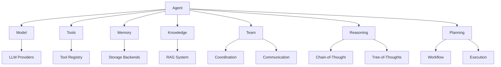

# Buddy AI Core Components

The core of Buddy AI consists of fundamental building blocks that power the entire framework. These components provide the essential functionality for creating, managing, and orchestrating AI agents.

## 🧩 Core Architecture

Buddy AI's core is built around these fundamental concepts:



## 🤖 Agent Class

The `Agent` class is the primary interface for creating AI agents:

```python
from buddy import Agent
from buddy.models.openai import OpenAIChat

agent = Agent(
    name="MyAgent",
    model=OpenAIChat(),
    instructions="You are a helpful AI assistant.",
    tools=[],  # List of tools
    memory=None,  # Memory configuration
    knowledge=None,  # Knowledge sources
    reasoning=None,  # Reasoning engine
    personality=None,  # Personality traits
    team=None  # Team configuration
)

# Basic interaction
response = agent.run("Hello, how can you help me?")
print(response.content)
```

### Agent Configuration

| Parameter | Type | Description |
|-----------|------|-------------|
| `name` | `str` | Unique identifier for the agent |
| `model` | `Model` | Language model instance |
| `instructions` | `str` | System instructions/personality |
| `tools` | `List[Tool]` | Available tools for the agent |
| `memory` | `Memory` | Memory management configuration |
| `knowledge` | `Knowledge` | Knowledge sources and RAG setup |
| `reasoning` | `Reasoning` | Advanced reasoning capabilities |
| `personality` | `Personality` | Personality traits and behavior |
| `team` | `Team` | Team collaboration settings |

### Agent Methods

```python
# Core interaction methods
agent.run(message: str) -> Response
agent.stream(message: str) -> Iterator[Response]
agent.chat(messages: List[Message]) -> Response

# State management
agent.get_memory() -> Memory
agent.set_memory(memory: Memory)
agent.save_state(path: str)
agent.load_state(path: str)

# Tool management
agent.add_tool(tool: Tool)
agent.remove_tool(tool_name: str)
agent.get_tools() -> List[Tool]

# Knowledge management
agent.add_knowledge(knowledge: Knowledge)
agent.update_knowledge()
agent.search_knowledge(query: str) -> List[Result]
```

## 🧠 Model Abstraction

Buddy AI supports 25+ language model providers through a unified interface:

```python
from buddy.models.base import Model
from buddy.models.openai import OpenAIChat
from buddy.models.anthropic import AnthropicChat
from buddy.models.google import GeminiChat

# Unified model interface
class Model:
    def generate(self, messages: List[Message]) -> Response:
        """Generate response from messages."""
        pass
    
    def stream(self, messages: List[Message]) -> Iterator[Response]:
        """Stream response tokens."""
        pass
    
    def embed(self, text: str) -> List[float]:
        """Generate embeddings."""
        pass
```

### Model Providers

| Provider | Models | Features |
|----------|--------|----------|
| **OpenAI** | GPT-4, GPT-3.5 | Function calling, vision |
| **Anthropic** | Claude 3.5, Claude 3 | Large context, safety |
| **Google** | Gemini Pro, Gemini Flash | Multimodal, fast inference |
| **AWS Bedrock** | Multiple models | Enterprise security |
| **Azure OpenAI** | OpenAI models on Azure | Enterprise integration |
| **Cohere** | Command, Command-R | RAG optimization |
| **Mistral** | Mistral Large, Medium | European AI |
| **Ollama** | Local models | Privacy, offline |

## 🛠️ Tool System

Tools extend agent capabilities with external actions:

```python
from buddy.tools.base import Tool
from buddy.tools.function import Function

class CustomTool(Tool):
    def __init__(self):
        super().__init__(
            name="custom_calculator",
            description="Performs mathematical calculations"
        )
    
    def calculate(self, expression: str) -> float:
        """Calculate mathematical expression."""
        return eval(expression)  # Simplified example

# Function-based tool
def get_weather(location: str) -> str:
    """Get current weather for a location."""
    # Weather API call implementation
    return f"Weather in {location}: Sunny, 75°F"

weather_tool = Function.from_callable(get_weather)
```

## 📚 Knowledge System

Integrate external knowledge sources with RAG:

```python
from buddy.knowledge import DocumentKnowledge, URLKnowledge

# Document-based knowledge
doc_knowledge = DocumentKnowledge(
    sources=["./documents/", "./pdfs/"],
    chunk_size=1000,
    overlap=200,
    embedder="openai",
    vector_store="chroma"
)

# URL-based knowledge
url_knowledge = URLKnowledge(
    urls=["https://docs.python.org"],
    depth=2,  # Crawl depth
    filters=["*.html"]  # File type filters
)

agent = Agent(
    model=OpenAIChat(),
    knowledge=[doc_knowledge, url_knowledge]
)
```

## 🧠 Memory System

Persistent conversation and learning memory:

```python
from buddy.memory import ConversationalMemory, MemoryManager

# Conversational memory
conv_memory = ConversationalMemory(
    max_history=100,
    storage="local",  # or "redis", "postgres"
    encryption=True
)

# Advanced memory manager
memory_manager = MemoryManager(
    types=["conversational", "episodic", "semantic"],
    storage_backend="postgres",
    retention_policy="7_days",
    compression=True
)

agent = Agent(
    model=OpenAIChat(),
    memory=memory_manager
)
```

## 🤝 Team Collaboration

Multi-agent coordination and collaboration:

```python
from buddy import Team
from buddy.team import TeamController

# Create specialized agents
researcher = Agent(name="Researcher", model=OpenAIChat(), role="research")
writer = Agent(name="Writer", model=OpenAIChat(), role="writing")
analyst = Agent(name="Analyst", model=OpenAIChat(), role="analysis")

# Form a team
team = Team(
    name="Content Team",
    agents=[researcher, writer, analyst],
    controller=TeamController(
        strategy="sequential",  # or "parallel", "democratic"
        communication="structured"
    )
)

# Collaborative task execution
result = team.collaborate(
    task="Create a comprehensive market analysis report",
    coordination="pipeline"  # researcher -> analyst -> writer
)
```

## 🎯 Planning and Workflow

Structured task planning and execution:

```python
from buddy.planning import PlanningAgent, ExecutionPlan

# Planning-enabled agent
planning_agent = PlanningAgent(
    model=OpenAIChat(),
    planning_strategy="hierarchical",
    execution_monitoring=True
)

# Create execution plan
plan = planning_agent.create_plan(
    objective="Analyze competitor landscape",
    constraints=["2 hour time limit", "use only public data"],
    resources=["web_search", "data_analysis"]
)

# Execute plan with monitoring
result = planning_agent.execute_plan(plan, monitor=True)
```

## 🏗️ Framework Architecture

Buddy AI follows a modular architecture pattern:

### Core Layers

1. **Interface Layer**: Agent, Team, Model APIs
2. **Service Layer**: Tools, Knowledge, Memory, Reasoning
3. **Infrastructure Layer**: Storage, Networking, Security
4. **Provider Layer**: LLM providers, Vector databases, Cloud services

### Design Principles

- **Modularity**: Each component is independent and replaceable
- **Extensibility**: Easy to add new tools, models, and capabilities
- **Scalability**: Supports single agents to large multi-agent systems
- **Security**: Built-in security and privacy protection
- **Observability**: Comprehensive logging, metrics, and monitoring

### Configuration Management

```python
from buddy.config import BuddyConfig

# Global configuration
config = BuddyConfig(
    default_model="openai/gpt-4",
    default_embedder="openai/text-embedding-3-small",
    storage_backend="postgres",
    vector_store="chroma",
    logging_level="INFO",
    security={
        "encryption_enabled": True,
        "api_key_rotation": True,
        "access_logging": True
    },
    performance={
        "caching_enabled": True,
        "connection_pooling": True,
        "rate_limiting": True
    }
)

# Apply configuration globally
Buddy.configure(config)
```

## 🚀 Quick Start Examples

### Simple Assistant
```python
from buddy import Agent
from buddy.models.openai import OpenAIChat

agent = Agent(model=OpenAIChat())
response = agent.run("What's the weather like today?")
```

### Knowledge-Enabled Agent
```python
from buddy import Agent
from buddy.models.openai import OpenAIChat
from buddy.knowledge import DocumentKnowledge

knowledge = DocumentKnowledge(sources=["./docs/"])
agent = Agent(model=OpenAIChat(), knowledge=[knowledge])
response = agent.run("What does our documentation say about API usage?")
```

### Tool-Enabled Agent
```python
from buddy import Agent
from buddy.models.openai import OpenAIChat
from buddy.tools import WebSearch, Calculator

agent = Agent(
    model=OpenAIChat(),
    tools=[WebSearch(), Calculator()]
)
response = agent.run("Search for Python tutorials and calculate 15% of 200")
```

### Team of Agents
```python
from buddy import Agent, Team
from buddy.models.openai import OpenAIChat

researcher = Agent(name="Researcher", model=OpenAIChat())
writer = Agent(name="Writer", model=OpenAIChat())

team = Team(agents=[researcher, writer])
result = team.collaborate("Research and write about AI trends")
```

The core components provide a solid foundation for building sophisticated AI agent applications, from simple chatbots to complex multi-agent systems.