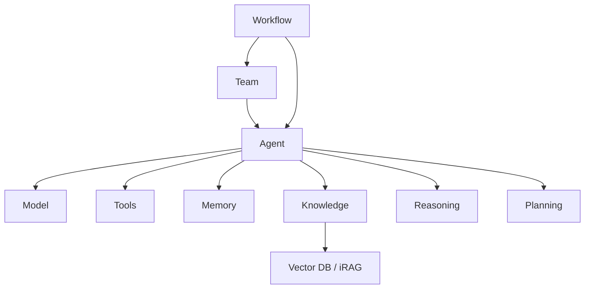

# Core Architecture

Buddy AI is built from a small set of composable building blocks. An **Agent**
is the central unit: it pairs a **Model** with optional **Tools**, **Memory**,
and **Knowledge**. Agents can be grouped into **Teams**, orchestrated by
**Workflows**, and enhanced with **Reasoning** and **Planning**.



## Agent

The `Agent` combines a model with capabilities and runs prompts. All
constructor arguments are keyword-only.

```python
from buddy import Agent
from buddy.models.openai import OpenAIChat

agent = Agent(
    name="assistant",
    model=OpenAIChat(id="gpt-4o-mini"),
    instructions="You are a helpful assistant.",
    markdown=True,
)

response = agent.run("What can you do?")   # returns a RunResponse
print(response.content)

agent.print_response("Explain RAG.", stream=True)   # stream to the console
```

`agent.run(msg, stream=True)` yields response chunks; `agent.arun(...)` and
`agent.aprint_response(...)` are the async variants. See [Agents](agents.md).

## Model

A unified `Model` interface backs 30+ providers under `buddy.models.<provider>`.
Swap providers by changing one import.

```python
from buddy.models.openai import OpenAIChat
from buddy.models.anthropic import Claude
from buddy.models.google import Gemini

model = Claude(id="claude-opus-4-5")
```

See [Models](models.md) for the full provider list and import paths.

## Tools

Tools let the model take actions. Pass built-in toolkits, plain functions, or
`@tool`-decorated functions in the `tools` list.

```python
from buddy.tools.calculator import CalculatorTools

agent = Agent(model=OpenAIChat(id="gpt-4o-mini"), tools=[CalculatorTools()])
```

See [Tools](tools.md) for built-in toolkits and custom-tool patterns.

## Memory

Agents have short-term **chat history** and durable **user memories**.

```python
from buddy.memory.v2.memory import Memory
from buddy.memory.v2.db.sqlite import SqliteMemoryDb

agent = Agent(
    model=OpenAIChat(id="gpt-4o-mini"),
    memory=Memory(db=SqliteMemoryDb(table_name="memories", db_file="memory.db")),
    enable_user_memories=True,
    add_history_to_messages=True,
    num_history_runs=3,
)
```

See [Memory](memory.md).

## Knowledge

Knowledge bases provide Retrieval-Augmented Generation. iRAG works without a
vector database; format-specific bases use one.

```python
from buddy.knowledge.pdf import PDFKnowledgeBase
from buddy.vectordb.chroma import ChromaDb

knowledge = PDFKnowledgeBase(
    path="docs/manual.pdf",
    vector_db=ChromaDb(collection="manual"),
)
knowledge.load()

agent = Agent(model=OpenAIChat(id="gpt-4o-mini"), knowledge=knowledge)
```

See [Knowledge](knowledge.md).

## Team

A `Team` coordinates multiple agents (or nested teams). The first argument,
`members`, is required; `mode` selects the orchestration strategy.

```python
from buddy import Agent, Team
from buddy.models.openai import OpenAIChat

researcher = Agent(name="researcher", model=OpenAIChat(id="gpt-4o-mini"), role="research")
writer = Agent(name="writer", model=OpenAIChat(id="gpt-4o-mini"), role="writing")

team = Team(members=[researcher, writer], mode="coordinate")
team.print_response("Research and write a short brief on AI agents.")
```

Modes are `"route"`, `"coordinate"` (default), and `"collaborate"`.

## Reasoning & Planning

Enable step-by-step reasoning directly on an agent, or use a dedicated
`PlanningAgent` for explicit plan creation and execution.

```python
# Reasoning: think through the problem before answering
agent = Agent(model=OpenAIChat(id="gpt-4o"), reasoning=True)

# Planning: decompose a goal into ordered steps
from buddy.planning import PlanningAgent
```

## Workflows

`Workflow` (`buddy.workflow`) lets you compose multi-step processes that drive
agents and teams programmatically — useful for repeatable pipelines and
deployments alongside [`FastAPIApp`](../getting-started/quickstart.md#5-deploy-as-an-api).

## Where to Go Next

- [Agents](agents.md) · [Models](models.md) · [Tools](tools.md)
- [Memory](memory.md) · [Knowledge](knowledge.md)
- [Competency Engine](../advanced/competency.md) · [PULSE](../advanced/pulse.md)
