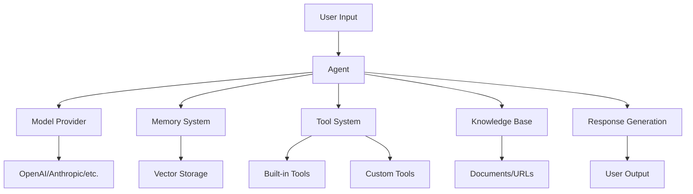

# Buddy AI - Comprehensive AI Agent Framework

<div align="center">


[](https://badge.fury.io/py/buddy-ai)
[](https://www.python.org/downloads/)
[](https://opensource.org/licenses/MIT)
[](https://github.com/esasrir91/buddy-ai/stargazers)

</div>

## Overview

**Buddy AI** is a comprehensive Python framework designed for building, deploying, and managing intelligent AI agents with enterprise-grade capabilities. It provides a unified interface to work with multiple LLM providers, advanced memory systems, and extensible tool frameworks.

!!! tip "PULSE — Autonomous Virtual Employee"
    **PULSE** is a flagship feature of buddy-ai v2.2.0. It is a fully autonomous virtual team member that works through your task queue, **creates real files** in its workspace, learns from documents and URLs, attends meetings, generates daily standups, suggests proactive tasks, and **remembers everything across sessions** — all without being prompted. One command starts it: `buddy pulse start`. [Full docs →](advanced/pulse.md)

## 🚀 Key Features

### 🤖 **Advanced Agent System**
- **Intelligent Agents** with persistent memory and personality
- **Multi-Agent Teams** with sophisticated orchestration
- **Agent Evolution** through automated improvement mechanisms
- **Personality Engine** for emotional intelligence and behavioral modeling

### 🧠 **Multi-Model Support**
- **30+ LLM Providers**: OpenAI, Anthropic, Google, AWS Bedrock, Azure, Cohere, and more
- **Unified Interface** across all providers
- **Model Switching** and failover capabilities
- **Custom Model Integration** support

### 🛠️ **Extensible Tool System**
- **200+ Built-in Tools** for common tasks
- **Custom Tool Creation** with simple decorators
- **Function Calling** with automatic schema generation
- **Tool Composition** and chaining capabilities

### 🧠 **Advanced Memory Architecture**
- **Conversation Memory** with intelligent summarization
- **Long-term Memory** storage and retrieval
- **User-specific Memories** across sessions
- **Knowledge Integration** with RAG capabilities

### 🌐 **Knowledge Management**
- **Multi-format Document Processing** (PDF, DOCX, MD, etc.)
- **Vector Database Integration** (ChromaDB, Pinecone, Weaviate)
- **Intelligent RAG** with semantic search and ranking
- **Real-time Knowledge Updates**

### 🚀 **Production-Ready Deployment**
- **FastAPI Integration** for REST APIs
- **Streamlit Apps** for interactive interfaces  
- **Docker & Kubernetes** support
- **Enterprise Security** features

## 🏗️ Architecture Overview



## 🎯 Core Modules

| Module | Description | Features |
|--------|-------------|----------|
| **[Agent](agents/agent-class.md)** | Core agent implementation | Memory, tools, personality, evolution |
| **[PULSE](advanced/pulse.md)** | Autonomous virtual employee | Tasks + real file output, persistent memory, KT, meetings, standups, notifications, web UI |
| **[Models](models/overview.md)** | LLM provider integrations | 30+ providers, unified interface |
| **[Tools](tools/overview.md)** | Function calling system | 200+ tools, custom creation |
| **[Memory](memory/overview.md)** | Memory management | Conversation, long-term, user memories |
| **[Knowledge](knowledge/overview.md)** | RAG and document processing | Multi-format, vector search |
| **[Team](team/overview.md)** | Multi-agent collaboration | Orchestration, communication |
| **[Workflows](workflows/overview.md)** | Process automation | Template-based, execution engine |
| **[Training](training/overview.md)** | Model fine-tuning | Data prep, training, evaluation |
| **[CLI](cli/overview.md)** | Command-line interface | Workspace management, operations |
| **[API](api/overview.md)** | REST API framework | FastAPI integration, endpoints |

## 🚦 Quick Start

### Installation
```bash
pip install buddy-ai[all]
```

### Basic Agent
```python
from buddy import Agent
from buddy.models.openai import OpenAIChat

agent = Agent(
    name="Assistant",
    model=OpenAIChat(),
    instructions="You are a helpful assistant."
)

response = agent.run("Hello, what can you do?")
print(response.content)
```

### With Memory and Tools
```python
from buddy import Agent
from buddy.models.openai import OpenAIChat
from buddy.tools.tavily import TavilyTools
from buddy.memory.agent import AgentMemory

agent = Agent(
    name="ResearchBot",
    model=OpenAIChat(),
    memory=AgentMemory(),
    tools=[TavilyTools()],
    instructions="You are a research assistant that can search the web."
)

response = agent.run("What are the latest developments in AI?")
print(response.content)
```

## 📚 Documentation Structure

This documentation is organized into the following sections:

- **[Getting Started](getting-started/installation.md)** - Installation, setup, and first steps
- **[Core Concepts](core/agents.md)** - Understanding the fundamental components
- **[Agent Framework](agents/agent-class.md)** - Deep dive into agent capabilities
- **[Model Providers](models/overview.md)** - Working with different LLM providers
- **[Tools & Functions](tools/overview.md)** - Building and using tools
- **[Memory System](memory/overview.md)** - Managing agent memory and state
- **[Knowledge Management](knowledge/overview.md)** - RAG and document processing
- **[Advanced Features](advanced/multimodal.md)** - Multi-modal, reasoning, planning
- **[Examples & Tutorials](examples/basic.md)** - Practical examples and use cases

## 🤝 Community & Support

- **GitHub**: [esasrir91/buddy-ai](https://github.com/esasrir91/buddy-ai)
- **Issues**: [Bug Reports & Feature Requests](https://github.com/esasrir91/buddy-ai/issues)
- **Discussions**: [Community Forum](https://github.com/esasrir91/buddy-ai/discussions)

## 📄 License

This project is licensed under the MIT License - see the [LICENSE](https://github.com/esasrir91/buddy-ai/blob/main/LICENSE) file for details.

---

<div align="center">

**Ready to build intelligent AI agents?** [Get started now →](getting-started/installation.md)

</div>