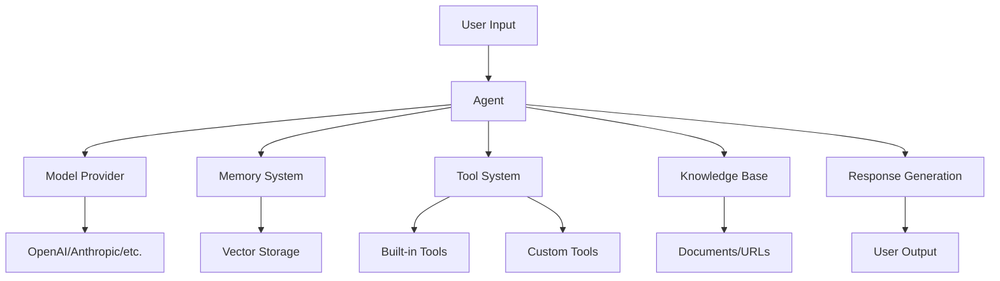

# Buddy AI

<div align="center" markdown>


### Build AI agents that *work for you* — not just chat with you.

**Buddy AI** is a batteries-included Python framework for building, deploying, and managing intelligent agents. One unified API gives you **30+ LLM providers**, **200+ tools**, persistent memory, RAG knowledge, multi-agent teams — and an autonomous virtual employee that ships real work while you sleep.

[](https://badge.fury.io/py/buddy-ai)
[](https://www.python.org/downloads/)
[](https://opensource.org/licenses/MIT)
[](https://github.com/esasrir91/buddy-ai/stargazers)

</div>

```bash
pip install buddy-ai[all]
```

[:octicons-rocket-24: Get started](getting-started/installation.md){ .md-button .md-button--primary }
[:octicons-book-24: Read the docs](getting-started/quickstart.md){ .md-button }

---

## ⭐ Featured in v2.2.0

!!! success "New release article"
    **v2.2.0 is here.** Read the full story behind the Competency Engine — plain English, runnable code, honest framing.

    [:octicons-book-24: Read the release article](articles/competency-engine-v2.2.0.md){ .md-button .md-button--primary }

<div class="grid cards" markdown>

-   :material-newspaper-variant-outline:{ .lg .middle } __Release article — Competency Engine__

    ---

    **Teaching AI Agents to Know What They Don't Know** — what's new in v2.2.0, the report-card metaphor, and three runnable code walkthroughs (scoring, autonomous loop, runtime routing).

    [:octicons-arrow-right-24: Read the article](articles/competency-engine-v2.2.0.md)

-   :material-account-hard-hat:{ .lg .middle } __PULSE — Autonomous Virtual Employee__

    ---

    A fully autonomous teammate that works your task queue, **creates real files** in its workspace, learns from documents and URLs, attends meetings, writes daily standups, suggests proactive work, and **remembers everything across sessions** — no babysitting required.

    One command starts it: `buddy pulse start`

    [:octicons-arrow-right-24: Meet PULSE](advanced/pulse.md)

-   :material-chart-bell-curve-cumulative:{ .lg .middle } __Competency Engine__

    ---

    A balance-aware **scoring & orchestration** layer that measures an agent or team's competency across domains, autonomously prioritizes the weakest gaps to train next, and **routes each task to the most competent member** with outcome feedback.

    *It measures, routes, and prioritizes — an interpretable layer on top of your models.*

    [:octicons-arrow-right-24: Explore the engine](advanced/competency.md)

</div>

---

## 🤔 Why Buddy AI?

<div class="grid cards" markdown>

-   :material-power-plug:{ .lg .middle } __One API, every model__

    ---

    Swap between OpenAI, Anthropic, Google, AWS Bedrock, Azure, Cohere and 30+ providers without rewriting your agent. Mix and match, fail over, and integrate custom models.

-   :material-toolbox:{ .lg .middle } __Tools out of the box__

    ---

    Ship faster with 200+ built-in tools, and add your own with a simple decorator. Automatic schema generation means function calling *just works*.

-   :material-brain:{ .lg .middle } __Memory that persists__

    ---

    Conversation summarization, long-term storage, and user-specific memories that carry across sessions — so your agents actually remember.

-   :material-rocket-launch:{ .lg .middle } __Production from day one__

    ---

    FastAPI REST apps, interactive UIs, Docker & Kubernetes support, and enterprise security features built into the framework.

</div>

---

## 🚀 Key Features

<div class="grid cards" markdown>

-   :material-robot:{ .lg .middle } __Advanced Agent System__

    ---

    - Intelligent agents with persistent memory and personality
    - Multi-agent teams with sophisticated orchestration
    - Agent evolution through automated improvement
    - Personality engine for behavioral modeling

    [:octicons-arrow-right-24: Agent framework](agents/agent-class.md)

-   :material-set-merge:{ .lg .middle } __Multi-Model Support__

    ---

    - 30+ LLM providers under one unified interface
    - Model switching and failover
    - Custom model integration

    [:octicons-arrow-right-24: Model providers](models/overview.md)

-   :material-tools:{ .lg .middle } __Extensible Tool System__

    ---

    - 200+ built-in tools for common tasks
    - Custom tool creation with simple decorators
    - Function calling, composition, and chaining

    [:octicons-arrow-right-24: Tools & functions](tools/overview.md)

-   :material-database-search:{ .lg .middle } __Knowledge & RAG__

    ---

    - Multi-format document processing (PDF, DOCX, MD…)
    - Vector database integration (ChromaDB, Pinecone, Weaviate)
    - Semantic search with intelligent ranking

    [:octicons-arrow-right-24: Knowledge management](knowledge/overview.md)

-   :material-account-group:{ .lg .middle } __Teams & Workflows__

    ---

    - Multi-agent collaboration and communication
    - Template-based workflow automation
    - A robust execution engine

    [:octicons-arrow-right-24: Team collaboration](team/overview.md)

-   :material-server-network:{ .lg .middle } __Deploy Anywhere__

    ---

    - FastAPI integration for REST APIs
    - Interactive apps and playgrounds
    - Docker & Kubernetes ready

    [:octicons-arrow-right-24: Deployment options](deployment/overview.md)

</div>

---

## 🚦 Quick Start

Spin up your first agent in a few lines:

```python
from buddy import Agent
from buddy.models.openai import OpenAIChat

agent = Agent(
    name="Assistant",
    model=OpenAIChat(),
    instructions="You are a helpful assistant.",
)

response = agent.run("Hello, what can you do?")
print(response.content)
```

Add memory and a real web-search tool to build a research assistant:

```python
from buddy import Agent
from buddy.models.openai import OpenAIChat
from buddy.tools.tavily import TavilyTools
from buddy.memory.agent import AgentMemory

agent = Agent(
    name="ResearchBot",
    model=OpenAIChat(),
    memory=AgentMemory(),
    tools=[TavilyTools()],
    instructions="You are a research assistant that can search the web.",
)

response = agent.run("What are the latest developments in AI?")
print(response.content)
```

!!! tip "Score and route your team's competency"
    Want to know where your agents are strong — and send each task to the right one?

    ```python
    from buddy.eval.competency import CompetencyEval

    ev = CompetencyEval(
        domains={"reasoning": 7, "memory": 6, "deployment": 4},
        base=9,
        dependency={("reasoning", "deployment"): 0.4},
    )
    result = ev.run()
    print(f"Competency index: {result.index:.2%}")
    print(f"Weakest domain:   {result.weakest_domain()}")
    ```

    [Dive into the Competency Engine →](advanced/competency.md)

---

## 🏗️ Architecture Overview



## 🎯 Core Modules

| Module | Description | Highlights |
|--------|-------------|------------|
| **[Agent](agents/agent-class.md)** | Core agent implementation | Memory, tools, personality, evolution |
| **[PULSE](advanced/pulse.md)** | Autonomous virtual employee | Real file output, persistent memory, meetings, standups, web UI |
| **[Competency Engine](advanced/competency.md)** | Scoring & orchestration | Domain scoring, gap prioritization, runtime routing |
| **[Models](models/overview.md)** | LLM provider integrations | 30+ providers, unified interface |
| **[Tools](tools/overview.md)** | Function calling system | 200+ tools, custom creation |
| **[Memory](memory/overview.md)** | Memory management | Conversation, long-term, user memories |
| **[Knowledge](knowledge/overview.md)** | RAG and document processing | Multi-format, vector search |
| **[Team](team/overview.md)** | Multi-agent collaboration | Orchestration, communication |
| **[Workflows](workflows/overview.md)** | Process automation | Template-based, execution engine |
| **[Training](training/overview.md)** | Model fine-tuning | Data prep, training, evaluation |
| **[CLI](cli/overview.md)** | Command-line interface | Workspace management, operations |
| **[API](api/overview.md)** | REST API framework | FastAPI integration, endpoints |

## 📚 Documentation Structure

This documentation is organized into the following sections:

- **[Getting Started](getting-started/installation.md)** — Installation, setup, and first steps
- **[Core Concepts](core/overview.md)** — Understanding the fundamental components
- **[Agent Framework](agents/agent-class.md)** — Deep dive into agent capabilities
- **[Model Providers](models/overview.md)** — Working with different LLM providers
- **[Tools & Functions](tools/overview.md)** — Building and using tools
- **[Memory System](memory/overview.md)** — Managing agent memory and state
- **[Knowledge Management](knowledge/overview.md)** — RAG and document processing
- **[Advanced Features](advanced/multimodal.md)** — Multi-modal, reasoning, planning, competency
- **[Examples & Tutorials](examples/basic.md)** — Practical examples and use cases

## 🤝 Community & Support

- **GitHub**: [esasrir91/buddy-ai](https://github.com/esasrir91/buddy-ai)
- **Issues**: [Bug Reports & Feature Requests](https://github.com/esasrir91/buddy-ai/issues)
- **Discussions**: [Community Forum](https://github.com/esasrir91/buddy-ai/discussions)

## 📄 License

This project is licensed under the MIT License — see the [LICENSE](https://github.com/esasrir91/buddy-ai/blob/main/LICENSE) file for details.

---

<div align="center" markdown>

**Ready to build intelligent AI agents?** [Get started now →](getting-started/installation.md)

</div>
