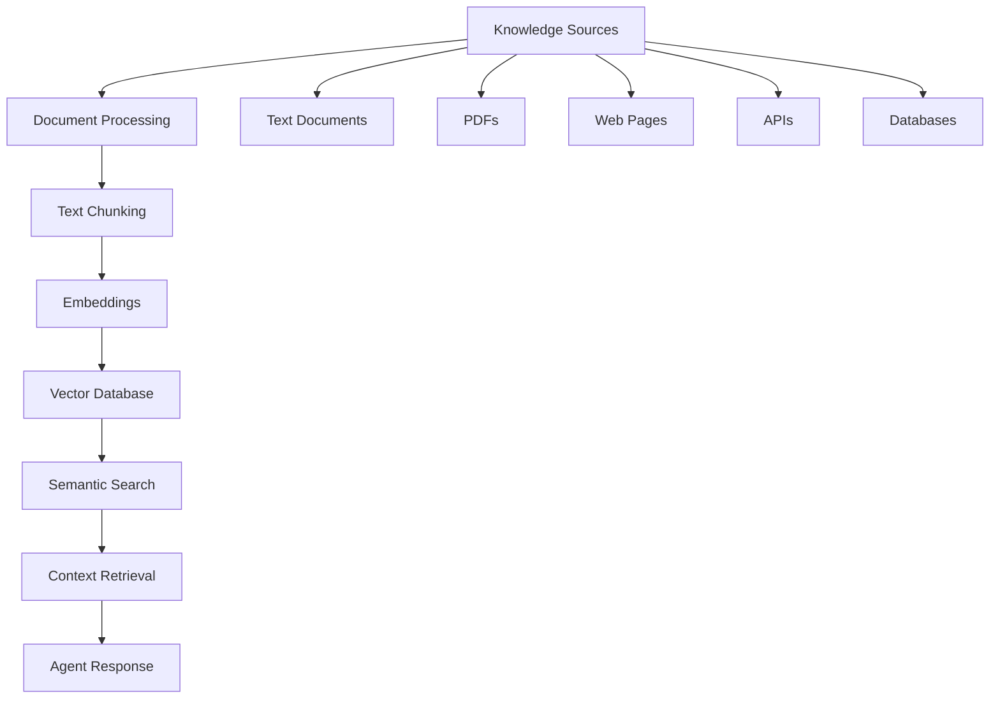

# Knowledge Management System

Buddy AI's knowledge management system provides advanced RAG (Retrieval-Augmented Generation) capabilities, allowing agents to access, process, and reason over vast amounts of information from multiple sources.

## 📚 Knowledge Sources Overview

| Source Type | Formats Supported | Use Cases |
|-------------|------------------|-----------|
| **Documents** | PDF, DOCX, TXT, MD, HTML | Manuals, reports, documentation |
| **Web Content** | URLs, websites, blogs | Real-time information, news |
| **Databases** | SQL, NoSQL, CSV, JSON | Structured data, analytics |
| **APIs** | REST, GraphQL | Live data feeds, services |
| **Media** | Audio transcripts, video | Multimedia content analysis |
| **Code** | GitHub repos, files | Code documentation, analysis |
| **Academic** | arXiv papers, research | Scientific knowledge |

## 🏗️ Architecture Overview



## 🚀 Quick Start

### Basic Knowledge Agent
```python
from buddy import Agent
from buddy.models.openai import OpenAIChat
from buddy.knowledge.agent import AgentKnowledge

# Create knowledge base
knowledge = AgentKnowledge()

# Add various sources
knowledge.add_text("Company founded in 2020. Specializes in AI solutions.")
knowledge.add_pdf("path/to/manual.pdf")
knowledge.add_url("https://company.com/policies")

# Agent with knowledge
agent = Agent(
    model=OpenAIChat(),
    knowledge=knowledge,
    instructions="Use the knowledge base to answer questions accurately."
)

response = agent.run("When was the company founded?")
print(response.content)  # "The company was founded in 2020."
```

## 📄 Document Processing

### Supported Document Types

#### PDF Documents
```python
from buddy.knowledge.pdf import PDFKnowledge

# Local PDF file
pdf_knowledge = PDFKnowledge()
pdf_knowledge.add_pdf("path/to/document.pdf")

# PDF from URL
from buddy.knowledge.pdf_url import PDFURLKnowledge
url_pdf = PDFURLKnowledge()
url_pdf.add_pdf_url("https://example.com/document.pdf")

# PDF from bytes
from buddy.knowledge.pdf_bytes import PDFBytesKnowledge
bytes_pdf = PDFBytesKnowledge()
with open("document.pdf", "rb") as f:
    bytes_pdf.add_pdf_bytes(f.read(), name="document")
```

**Features:**
- Text extraction from all pages
- Preserve formatting and structure
- Handle encrypted PDFs
- Extract metadata (title, author, etc.)
- Support for scanned PDFs (OCR)

#### DOCX Documents
```python
from buddy.knowledge.docx import DOCXKnowledge

docx_knowledge = DOCXKnowledge()
docx_knowledge.add_docx("path/to/document.docx")
```

**Features:**
- Extract text from Word documents
- Preserve headings and structure
- Handle embedded images and tables
- Extract comments and track changes

#### Text and Markdown
```python
from buddy.knowledge.text import TextKnowledge
from buddy.knowledge.markdown import MarkdownKnowledge

# Plain text
text_knowledge = TextKnowledge()
text_knowledge.add_text("Important information here...")
text_knowledge.add_text_file("path/to/file.txt")

# Markdown with structure preservation
md_knowledge = MarkdownKnowledge()
md_knowledge.add_markdown_file("README.md")
md_knowledge.add_markdown_url("https://github.com/user/repo/README.md")
```

#### JSON Data
```python
from buddy.knowledge.json import JSONKnowledge

json_knowledge = JSONKnowledge()

# Add JSON file
json_knowledge.add_json_file("data.json")

# Add JSON data directly
data = {"products": [{"id": 1, "name": "Widget"}]}
json_knowledge.add_json_data(data, name="product_catalog")

# Add JSON from URL
json_knowledge.add_json_url("https://api.example.com/data")
```

#### CSV Data
```python
from buddy.knowledge.csv import CSVKnowledge

csv_knowledge = CSVKnowledge()

# Local CSV file
csv_knowledge.add_csv("sales_data.csv")

# CSV from URL
from buddy.knowledge.csv_url import CSVURLKnowledge
url_csv = CSVURLKnowledge()
url_csv.add_csv_url("https://example.com/data.csv")
```

**Advanced CSV Options:**
```python
csv_knowledge.add_csv(
    "data.csv",
    delimiter=",",
    encoding="utf-8",
    max_rows=10000,
    columns_to_index=["name", "description"],
    date_columns=["created_at"]
)
```

## 🌐 Web Content Sources

### Website Knowledge
```python
from buddy.knowledge.website import WebsiteKnowledge

website = WebsiteKnowledge()

# Add single URL
website.add_url("https://example.com/article")

# Crawl entire website
website.add_website(
    "https://docs.example.com",
    max_depth=3,
    max_pages=100,
    include_patterns=["*/docs/*"],
    exclude_patterns=["*/admin/*"]
)
```

### URL Processing
```python
from buddy.knowledge.url import URLKnowledge

url_knowledge = URLKnowledge(
    timeout=30,
    headers={"User-Agent": "BuddyAI"},
    follow_redirects=True
)

# Add multiple URLs
urls = [
    "https://blog.example.com/post1",
    "https://blog.example.com/post2",
    "https://news.example.com/article"
]

for url in urls:
    url_knowledge.add_url(url)
```

### Firecrawl Integration
Advanced web scraping with Firecrawl.

```python
from buddy.knowledge.firecrawl import FirecrawlKnowledge

firecrawl = FirecrawlKnowledge(api_key="your-firecrawl-key")

# Scrape with advanced options
firecrawl.scrape_url(
    "https://example.com",
    formats=["markdown", "html"],
    only_main_content=True,
    include_tags=["title", "meta", "h1", "h2", "p"],
    remove_tags=["nav", "footer", "aside"]
)

# Crawl entire site
firecrawl.crawl_website(
    "https://docs.example.com",
    max_pages=50,
    allow_backward_crawling=False,
    allow_external_links=False
)
```

## 📚 Academic and Research Sources

### arXiv Papers
```python
from buddy.knowledge.arxiv import ArxivKnowledge

arxiv = ArxivKnowledge()

# Search and add papers
arxiv.search_and_add(
    query="machine learning",
    max_results=10,
    category="cs.AI"
)

# Add specific paper by ID
arxiv.add_paper("2301.07041")  # Paper ID

# Add by title
arxiv.add_by_title("Attention Is All You Need")
```

### Wikipedia Integration
```python
from buddy.knowledge.wikipedia import WikipediaKnowledge

wiki = WikipediaKnowledge(language="en")

# Add Wikipedia page
wiki.add_page("Machine Learning")

# Search and add multiple pages
wiki.search_and_add(
    query="artificial intelligence",
    max_pages=5,
    include_disambiguation=False
)
```

### YouTube Content
```python
from buddy.knowledge.youtube import YouTubeKnowledge

youtube = YouTubeKnowledge()

# Add video transcript
youtube.add_video("dQw4w9WgXcQ")  # Video ID

# Search and add videos
youtube.search_and_add(
    query="machine learning tutorial",
    max_videos=5,
    min_duration=300  # 5 minutes minimum
)
```

## 🔗 Integration Platforms

### LangChain Integration
```python
from buddy.knowledge.langchain import LangChainKnowledge

# Use LangChain document loaders
langchain = LangChainKnowledge()

# Add documents via LangChain loaders
from langchain.document_loaders import WebBaseLoader
loader = WebBaseLoader("https://example.com")
langchain.add_langchain_documents(loader.load())
```

### LlamaIndex Integration
```python
from buddy.knowledge.llamaindex import LlamaIndexKnowledge

llamaindex = LlamaIndexKnowledge()

# Use LlamaIndex readers
from llama_index.readers import PDFReader
reader = PDFReader()
documents = reader.load_data("document.pdf")
llamaindex.add_llamaindex_documents(documents)
```

## 💾 Storage Backends

### Cloud Storage Integration

#### Google Cloud Storage
```python
from buddy.knowledge.gcs import GCSKnowledge

gcs = GCSKnowledge(
    credentials_path="path/to/credentials.json",
    bucket_name="your-bucket"
)

# Add files from GCS
gcs.add_gcs_file("documents/manual.pdf")
gcs.add_gcs_folder("knowledge_base/")
```

#### AWS S3
```python
from buddy.knowledge.s3 import S3Knowledge

s3 = S3Knowledge(
    aws_access_key_id="your-access-key",
    aws_secret_access_key="your-secret-key",
    bucket_name="your-bucket",
    region="us-east-1"
)

# Add files from S3
s3.add_s3_file("documents/manual.pdf")
s3.add_s3_prefix("knowledge_base/")
```

## 🔍 Advanced RAG Features

### Intelligent RAG (iRAG)
Buddy AI's proprietary intelligent RAG system.

```python
from buddy.knowledge.irag import iRAGKnowledge

irag = iRAGKnowledge(
    chunk_size=1000,
    chunk_overlap=200,
    rerank_top_k=10,
    use_semantic_chunking=True,
    enable_query_expansion=True,
    enable_context_compression=True
)

# Add documents with intelligent processing
irag.add_document(
    "complex_manual.pdf",
    document_type="technical_manual",
    importance_level="high"
)
```

**iRAG Features:**
- **Semantic Chunking**: Intelligent text segmentation
- **Query Expansion**: Automatic query enhancement
- **Context Compression**: Relevant content extraction
- **Multi-hop Reasoning**: Complex question answering
- **Source Attribution**: Track information provenance

### LightRAG Integration
Lightweight RAG implementation.

```python
from buddy.knowledge.light_rag import LightRAGKnowledge

light_rag = LightRAGKnowledge(
    model_name="gpt-4",
    embedding_model="text-embedding-3-large",
    chunk_size=500,
    top_k=5
)

light_rag.add_documents([
    "document1.txt",
    "document2.pdf",
    "document3.md"
])
```

### Combined Knowledge Sources
```python
from buddy.knowledge.combined import CombinedKnowledge

# Combine multiple knowledge sources
combined = CombinedKnowledge()

# Add different sources with weights
combined.add_source(pdf_knowledge, weight=0.4, name="manuals")
combined.add_source(website_knowledge, weight=0.3, name="web_content")
combined.add_source(arxiv_knowledge, weight=0.3, name="research")

# Query across all sources
results = combined.search("machine learning applications", top_k=10)
```

## ⚙️ Configuration Options

### Embedding Models
```python
from buddy.embedder.openai import OpenAIEmbedder
from buddy.embedder.sentence_transformer import SentenceTransformerEmbedder

# OpenAI embeddings
openai_embedder = OpenAIEmbedder(
    model="text-embedding-3-large",
    dimensions=1536
)

# Local embeddings
local_embedder = SentenceTransformerEmbedder(
    model_name="all-MiniLM-L6-v2",
    device="cpu"
)

# Configure knowledge with custom embedder
knowledge = AgentKnowledge(embedder=openai_embedder)
```

### Vector Database Options
```python
from buddy.vectordb.chromadb import ChromaDBVectorDB
from buddy.vectordb.pinecone import PineconeVectorDB

# ChromaDB (local)
chroma_db = ChromaDBVectorDB(
    collection_name="knowledge_base",
    persist_directory="./chroma_db"
)

# Pinecone (cloud)
pinecone_db = PineconeVectorDB(
    api_key="your-pinecone-key",
    environment="us-west1-gcp",
    index_name="knowledge-index"
)

# Configure knowledge with custom vector DB
knowledge = AgentKnowledge(vector_db=chroma_db)
```

### Text Chunking Strategies
```python
# Token-based chunking
knowledge = AgentKnowledge(
    chunk_size=1000,
    chunk_overlap=200,
    chunking_strategy="token"
)

# Semantic chunking
knowledge = AgentKnowledge(
    chunking_strategy="semantic",
    min_chunk_size=100,
    max_chunk_size=1500,
    similarity_threshold=0.8
)

# Paragraph-based chunking
knowledge = AgentKnowledge(
    chunking_strategy="paragraph",
    preserve_structure=True
)
```

## 🔍 Search and Retrieval

### Basic Search
```python
# Simple search
results = knowledge.search(
    query="company policies",
    limit=5
)

for result in results:
    print(f"Score: {result.score}")
    print(f"Source: {result.source}")
    print(f"Content: {result.content[:200]}...")
```

### Advanced Search Options
```python
# Advanced search with filters
results = knowledge.search(
    query="machine learning applications",
    limit=10,
    score_threshold=0.7,
    filters={
        "source_type": ["pdf", "webpage"],
        "date_range": ("2023-01-01", "2024-12-31"),
        "tags": ["ai", "ml"]
    },
    rerank=True,
    include_metadata=True
)
```

### Hybrid Search
```python
# Combine semantic and keyword search
results = knowledge.hybrid_search(
    query="neural network architectures",
    semantic_weight=0.7,
    keyword_weight=0.3,
    limit=10
)
```

### Multi-Query Search
```python
# Search with multiple related queries
queries = [
    "company remote work policy",
    "work from home guidelines",
    "flexible work arrangements"
]

results = knowledge.multi_query_search(
    queries=queries,
    combine_method="rank_fusion",  # or "score_fusion"
    limit=15
)
```

## 📊 Knowledge Analytics

### Knowledge Base Statistics
```python
# Get knowledge base statistics
stats = knowledge.get_statistics()

print(f"Total documents: {stats['total_documents']}")
print(f"Total chunks: {stats['total_chunks']}")
print(f"Average chunk size: {stats['avg_chunk_size']}")
print(f"Source types: {stats['source_types']}")
print(f"Last updated: {stats['last_updated']}")
```

### Content Analysis
```python
# Analyze knowledge content
analysis = knowledge.analyze_content()

print(f"Top topics: {analysis['top_topics']}")
print(f"Keyword frequency: {analysis['keyword_freq']}")
print(f"Document similarity matrix: {analysis['similarity_matrix']}")
```

### Query Analytics
```python
# Track search patterns
knowledge.enable_query_logging()

# After some queries...
query_stats = knowledge.get_query_statistics()
print(f"Most common queries: {query_stats['common_queries']}")
print(f"Average response time: {query_stats['avg_response_time']}")
print(f"Query success rate: {query_stats['success_rate']}")
```

## 🔄 Knowledge Updates

### Real-time Updates
```python
# Enable automatic updates
knowledge.enable_auto_refresh(
    check_interval=3600,  # Check every hour
    update_threshold=0.1   # Update if 10% content changed
)

# Manual refresh
knowledge.refresh_sources()

# Update specific source
knowledge.update_source("https://example.com/page")
```

### Version Control
```python
# Enable knowledge versioning
knowledge.enable_versioning()

# Create snapshot
snapshot_id = knowledge.create_snapshot("before_update")

# Rollback to previous version
knowledge.rollback_to_snapshot(snapshot_id)

# List all versions
versions = knowledge.list_versions()
```

### Change Detection
```python
# Monitor for changes
changes = knowledge.detect_changes()

for change in changes:
    print(f"Source: {change['source']}")
    print(f"Change type: {change['type']}")  # 'added', 'modified', 'deleted'
    print(f"Timestamp: {change['timestamp']}")
```

## 🛡️ Security and Access Control

### Content Filtering
```python
# Set up content filters
knowledge.add_content_filter(
    filter_type="profanity",
    action="remove"  # or "flag", "replace"
)

knowledge.add_content_filter(
    filter_type="pii",  # Personally Identifiable Information
    action="redact",
    redaction_text="[REDACTED]"
)
```

### Access Control
```python
# Role-based access
knowledge.set_access_control(
    roles={
        "admin": ["read", "write", "delete"],
        "user": ["read"],
        "guest": ["read_limited"]
    }
)

# Source-level permissions
knowledge.set_source_permissions(
    source_id="confidential_docs",
    allowed_roles=["admin", "manager"]
)
```

### Data Privacy
```python
# Enable data privacy features
knowledge.configure_privacy(
    anonymize_user_queries=True,
    encrypt_storage=True,
    data_retention_days=90,
    gdpr_compliant=True
)
```

## 🚀 Performance Optimization

### Caching Strategies
```python
# Enable query result caching
knowledge.enable_caching(
    cache_type="memory",  # or "redis", "file"
    cache_size=1000,
    ttl=3600  # 1 hour
)
```

### Batch Processing
```python
# Add documents in batches
documents = ["doc1.pdf", "doc2.pdf", "doc3.pdf"]

knowledge.batch_add_documents(
    documents,
    batch_size=10,
    parallel=True,
    max_workers=4
)
```

### Index Optimization
```python
# Optimize vector index
knowledge.optimize_index(
    reindex=True,
    compress=True,
    remove_duplicates=True
)
```

## 📈 Best Practices

### Knowledge Organization
```python
# Organize with tags and metadata
knowledge.add_document(
    "employee_handbook.pdf",
    tags=["hr", "policy", "internal"],
    metadata={
        "department": "human_resources",
        "version": "2024.1",
        "classification": "internal"
    }
)
```

### Quality Control
```python
# Validate document quality
quality_score = knowledge.assess_document_quality("document.pdf")

if quality_score > 0.8:
    knowledge.add_document("document.pdf")
else:
    print("Document quality too low, manual review needed")
```

### Monitoring and Alerting
```python
# Set up monitoring
knowledge.configure_monitoring(
    alert_on_errors=True,
    performance_threshold=2.0,  # seconds
    storage_limit_gb=100,
    webhook_url="https://alerts.example.com"
)
```

This comprehensive knowledge management system enables Buddy AI agents to access and reason over vast amounts of information, providing accurate, contextual responses based on your specific knowledge base.