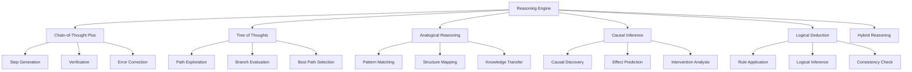

# Advanced Reasoning Engine

Buddy AI's reasoning engine implements sophisticated cognitive processes that enable agents to tackle complex problems through structured thinking, multi-step analysis, and strategic problem decomposition.

## 🧠 Reasoning Overview

The reasoning system provides multiple cognitive strategies:

- **Chain-of-Thought Plus**: Enhanced step-by-step reasoning with verification
- **Tree of Thoughts**: Parallel exploration of multiple reasoning paths
- **Analogical Reasoning**: Knowledge transfer through structural similarity
- **Causal Inference**: Understanding cause-and-effect relationships
- **Logical Deduction**: Formal logic and rule-based reasoning
- **Hybrid Reasoning**: Combining multiple strategies for optimal results



## 🚀 Quick Start

### Basic Reasoning Setup
```python
from buddy import Agent
from buddy.models.openai import OpenAIChat
from buddy.reasoning import AdvancedReasoning, ReasoningStrategy

# Create agent with reasoning capabilities
reasoning_engine = AdvancedReasoning(
    strategies=["chain_of_thought_plus", "tree_of_thoughts"],
    verification_enabled=True,
    self_correction=True
)

agent = Agent(
    model=OpenAIChat(),
    reasoning=reasoning_engine,
    instructions="Use advanced reasoning for complex problems."
)

# Apply reasoning to a problem
response = agent.run(
    "How can we reduce carbon emissions in urban transportation while maintaining economic growth?"
)

print(f"Solution: {response.content}")
print(f"Reasoning steps: {response.reasoning_trace}")
```

### Advanced Reasoning Agent
```python
from buddy.reasoning import AdvancedReasoningMixin

class ExpertProblemSolver(AdvancedReasoningMixin, Agent):
    def __init__(self):
        super().__init__(
            model=OpenAIChat(),
            reasoning_config={
                "default_strategy": "hybrid",
                "verification_depth": "deep",
                "max_reasoning_steps": 20,
                "parallel_thinking": True
            }
        )
    
    def solve_complex_problem(self, problem: str, domain: str = "general"):
        """Solve complex problems with domain-specific reasoning."""
        return self.reason_advanced(
            problem=problem,
            strategy=ReasoningStrategy.HYBRID,
            domain_context=domain,
            require_verification=True
        )

# Use the expert solver
expert = ExpertProblemSolver()
solution = expert.solve_complex_problem(
    "Design a sustainable energy grid for a smart city",
    domain="energy_systems"
)
```

## 🔗 Chain-of-Thought Plus

Enhanced chain-of-thought reasoning with verification and error correction.

### Core Features

```python
from buddy.reasoning.chain_of_thought import ChainOfThoughtPlus

cot_plus = ChainOfThoughtPlus(
    verification_strategy="step_by_step",  # Verify each reasoning step
    error_detection="contradiction_check", # Detect logical contradictions
    self_correction=True,                   # Auto-correct reasoning errors
    alternative_paths=True,                 # Explore alternative reasoning
    confidence_estimation=True              # Estimate confidence in reasoning
)

# Apply to complex reasoning task
result = cot_plus.reason(
    problem="A pharmaceutical company needs to decide whether to continue developing a drug that shows 60% efficacy but has mild side effects in 30% of patients. The development cost is $100M more, and competitors have a 40% effective drug with 10% side effects. What should they do?",
    context={
        "domain": "pharmaceutical_business",
        "stakeholders": ["patients", "shareholders", "regulators"],
        "time_constraint": "6_months_to_market",
        "budget_limit": "$500M_total"
    }
)

print("Reasoning Chain:")
for i, step in enumerate(result.reasoning_steps, 1):
    print(f"Step {i}: {step.content}")
    print(f"  Verification: {step.verification_status}")
    print(f"  Confidence: {step.confidence:.2f}")

print(f"\nFinal Decision: {result.conclusion}")
print(f"Overall Confidence: {result.final_confidence:.2f}")
```

### Verification Mechanisms

```python
# Step-by-step verification
verifier = ChainOfThoughtVerifier(
    verification_methods=[
        "logical_consistency",     # Check for logical contradictions
        "factual_accuracy",       # Verify factual claims
        "causal_validity",        # Validate causal relationships
        "assumption_checking",    # Examine underlying assumptions
        "alternative_consideration" # Consider alternative explanations
    ],
    
    # Error handling
    error_responses={
        "contradiction": "explore_alternative_path",
        "factual_error": "correct_and_continue",
        "weak_logic": "strengthen_reasoning",
        "missing_info": "gather_additional_evidence"
    }
)

# Reasoning with verification
verified_result = cot_plus.reason_with_verification(
    problem="Should a city implement congestion pricing?",
    verifier=verifier,
    max_verification_rounds=3
)
```

## 🌳 Tree of Thoughts

Explore multiple reasoning paths simultaneously to find optimal solutions.

### Tree Exploration

```python
from buddy.reasoning.tree_of_thoughts import TreeOfThoughts

tot = TreeOfThoughts(
    branching_factor=3,         # Number of alternative thoughts per step
    max_depth=5,               # Maximum reasoning depth
    evaluation_method="scoring", # How to evaluate thoughts
    pruning_strategy="bottom_percentile", # Remove weak branches
    best_path_selection="confidence_weighted"
)

# Complex problem requiring multiple perspectives
result = tot.explore_thoughts(
    problem="How can a small business compete with large corporations?",
    initial_thoughts=[
        "Focus on customer service excellence",
        "Specialize in niche markets",
        "Leverage technology for efficiency"
    ],
    evaluation_criteria=[
        "feasibility",
        "potential_impact", 
        "resource_requirements",
        "competitive_advantage"
    ]
)

print("Reasoning Tree:")
for path in result.explored_paths:
    print(f"Path {path.id}: {' -> '.join(path.thoughts)}")
    print(f"  Score: {path.score:.3f}")
    print(f"  Evaluation: {path.evaluation}\n")

print(f"Best Strategy: {result.best_path.final_thought}")
```

### Thought Evaluation

```python
from buddy.reasoning.evaluation import ThoughtEvaluator

# Custom thought evaluation
evaluator = ThoughtEvaluator(
    scoring_dimensions=[
        {"name": "creativity", "weight": 0.3},
        {"name": "practicality", "weight": 0.4},
        {"name": "evidence_support", "weight": 0.3}
    ],
    
    # Evaluation methods
    scoring_methods=[
        "semantic_similarity",    # Compare to successful patterns
        "logical_consistency",   # Internal logical coherence
        "novelty_assessment",    # Originality of approach
        "implementation_ease"    # How easy to implement
    ]
)

# Evaluate reasoning path
path_score = evaluator.evaluate_path(
    thoughts=["Identify unique value", "Build customer loyalty", "Scale strategically"],
    context={"business_type": "retail", "market_size": "local", "budget": "limited"}
)
```

## 🔄 Analogical Reasoning

Transfer knowledge from familiar domains to solve novel problems.

### Pattern Matching

```python
from buddy.reasoning.analogical import AnalogicalReasoning

analogical = AnalogicalReasoning(
    knowledge_base="expert_cases",     # Source of analogies
    similarity_threshold=0.7,          # Minimum similarity for analogy
    structure_mapping=True,            # Map structural relationships
    adaptation_strategies=[            # How to adapt analogies
        "direct_mapping",
        "constraint_relaxation",
        "goal_substitution"
    ]
)

# Solve problem using analogies
result = analogical.solve_by_analogy(
    target_problem="How to improve team communication in remote work?",
    source_domains=["orchestra_coordination", "sports_team_strategy", "military_operations"],
    mapping_constraints={
        "preserve_hierarchy": True,
        "maintain_efficiency": True,
        "ensure_clarity": True
    }
)

print("Analogical Solutions:")
for analogy in result.analogies:
    print(f"Source: {analogy.source_domain}")
    print(f"Mapping: {analogy.structural_mapping}")
    print(f"Adapted Solution: {analogy.adapted_solution}")
    print(f"Confidence: {analogy.confidence:.2f}\n")
```

### Cross-Domain Knowledge Transfer

```python
from buddy.reasoning.knowledge_transfer import CrossDomainTransfer

transfer_engine = CrossDomainTransfer(
    source_domains=[
        "biology", "physics", "economics", "psychology", 
        "engineering", "military_strategy", "game_theory"
    ],
    
    transfer_mechanisms=[
        "structural_analogy",     # Transfer structural relationships
        "functional_analogy",     # Transfer functional patterns
        "causal_analogy",        # Transfer causal mechanisms
        "process_analogy"         # Transfer process patterns
    ]
)

# Transfer knowledge for innovation
innovation = transfer_engine.transfer_for_innovation(
    target_challenge="Reduce energy consumption in data centers",
    innovation_type="efficiency_improvement",
    transfer_depth="deep"  # Surface, medium, or deep transfer
)
```

## ⚖️ Causal Inference

Understand and reason about cause-and-effect relationships.

### Causal Discovery

```python
from buddy.reasoning.causal import CausalInference

causal_engine = CausalInference(
    discovery_methods=[
        "correlation_analysis",   # Statistical correlation
        "temporal_precedence",    # Time-based causality
        "intervention_analysis",  # Effect of interventions
        "mechanism_identification" # Causal mechanisms
    ],
    
    # Inference strategies
    inference_types=[
        "direct_causation",       # A causes B
        "indirect_causation",     # A causes B through C
        "common_cause",          # A and B caused by C
        "reverse_causation",     # B causes A (opposite)
        "spurious_correlation"   # No causal relationship
    ]
)

# Analyze causal relationships
causal_analysis = causal_engine.analyze_causation(
    problem="Why did sales decrease last quarter?",
    variables=[
        "marketing_spend", "product_quality", "competitor_actions",
        "economic_conditions", "customer_satisfaction", "sales_volume"
    ],
    data_sources=["sales_data", "market_research", "customer_feedback"]
)

print("Causal Analysis Results:")
for relationship in causal_analysis.causal_relationships:
    print(f"Cause: {relationship.cause}")
    print(f"Effect: {relationship.effect}")
    print(f"Strength: {relationship.strength:.2f}")
    print(f"Confidence: {relationship.confidence:.2f}")
    print(f"Mechanism: {relationship.mechanism}\n")
```

### Intervention Analysis

```python
# Predict effects of interventions
intervention_analyzer = causal_engine.create_intervention_analyzer()

# Analyze potential interventions
interventions = [
    {"action": "increase_marketing_budget", "amount": "20%"},
    {"action": "improve_product_quality", "investment": "$100k"},
    {"action": "reduce_prices", "percentage": "10%"}
]

for intervention in interventions:
    effect = intervention_analyzer.predict_intervention_effect(
        intervention=intervention,
        target_outcome="sales_volume",
        time_horizon="3_months"
    )
    
    print(f"Intervention: {intervention}")
    print(f"Predicted Effect: {effect.magnitude:.2f} change")
    print(f"Confidence: {effect.confidence:.2f}")
    print(f"Side Effects: {effect.side_effects}\n")
```

## 🔐 Logical Deduction

Formal logic and rule-based reasoning for precise problem solving.

### Rule-Based Reasoning

```python
from buddy.reasoning.logical import LogicalReasoning

logical_reasoner = LogicalReasoning(
    logic_types=["propositional", "predicate", "temporal", "modal"],
    inference_rules=[
        "modus_ponens",           # If P then Q, P, therefore Q
        "modus_tollens",          # If P then Q, not Q, therefore not P
        "hypothetical_syllogism", # If P then Q, if Q then R, therefore if P then R
        "disjunctive_syllogism",  # P or Q, not P, therefore Q
        "resolution",             # Clause resolution for theorem proving
        "natural_deduction"       # Natural deduction rules
    ]
)

# Define logical rules and facts
rules = [
    "If it rains, then the ground gets wet",
    "If the ground gets wet, then plants grow",
    "If plants grow, then oxygen is produced",
    "It is raining"
]

facts = [
    "Weather forecast shows rain",
    "Soil moisture is low",
    "Plants need water to grow"
]

# Perform logical deduction
deduction = logical_reasoner.deduce(
    rules=rules,
    facts=facts,
    goal="Will oxygen be produced?",
    proof_strategy="forward_chaining"
)

print("Logical Deduction Chain:")
for step in deduction.proof_steps:
    print(f"Step {step.number}: {step.conclusion}")
    print(f"  Rule applied: {step.rule_applied}")
    print(f"  Premises: {step.premises}")
```

## 🔀 Hybrid Reasoning

Combine multiple reasoning strategies for optimal problem solving.

### Multi-Strategy Integration

```python
from buddy.reasoning.hybrid import HybridReasoning

hybrid_reasoner = HybridReasoning(
    strategies=[
        {"name": "chain_of_thought_plus", "weight": 0.3},
        {"name": "tree_of_thoughts", "weight": 0.25},
        {"name": "analogical_reasoning", "weight": 0.2},
        {"name": "causal_inference", "weight": 0.15},
        {"name": "logical_deduction", "weight": 0.1}
    ],
    
    # Integration methods
    combination_strategy="weighted_fusion",  # How to combine results
    confidence_aggregation="harmonic_mean",  # How to combine confidences
    conflict_resolution="evidence_strength", # How to resolve conflicts
    
    # Adaptive selection
    dynamic_weighting=True,  # Adjust weights based on problem type
    strategy_selection="problem_adaptive",  # Select best strategies for problem
    performance_learning=True  # Learn which strategies work best
)

# Complex problem requiring multiple reasoning approaches
complex_problem = """
A city wants to implement a new transportation system. They're considering:
1. Electric buses (high upfront cost, low operating cost, environmentally friendly)
2. Light rail (very high cost, efficient for high volume, requires infrastructure)
3. Bike sharing (low cost, health benefits, limited by weather)
4. Autonomous shuttles (experimental, potentially very efficient, regulatory challenges)

The city has a $50M budget, serves 200,000 people, has moderate climate, 
and wants to reduce emissions by 40% while maintaining accessibility for all residents.
What should they choose and why?
"""

hybrid_result = hybrid_reasoner.solve(
    problem=complex_problem,
    context={
        "domain": "urban_planning",
        "stakeholders": ["residents", "city_government", "environment"],
        "constraints": ["budget", "timeline", "accessibility", "emissions"],
        "success_metrics": ["cost_effectiveness", "emission_reduction", "user_adoption"]
    }
)

print("Hybrid Reasoning Results:")
print(f"Recommended Solution: {hybrid_result.recommendation}")
print(f"Overall Confidence: {hybrid_result.confidence:.2f}\n")

print("Strategy Contributions:")
for strategy, contribution in hybrid_result.strategy_contributions.items():
    print(f"  {strategy}: {contribution.weight:.2f} confidence")
    print(f"    Key insights: {contribution.key_insights}")
    print(f"    Supporting evidence: {contribution.evidence}\n")
```

### Adaptive Strategy Selection

```python
from buddy.reasoning.adaptive import AdaptiveReasoningSelector

# Automatically select best reasoning strategies
adaptive_selector = AdaptiveReasoningSelector(
    problem_classifiers=[
        "problem_complexity",     # Simple, medium, complex
        "domain_knowledge_req",   # Low, medium, high domain knowledge
        "uncertainty_level",      # Low, medium, high uncertainty
        "time_sensitivity",       # Not urgent, moderate, urgent
        "stakeholder_count",      # Few, several, many stakeholders
        "data_availability"       # Limited, moderate, abundant data
    ],
    
    strategy_mappings={
        "simple_factual": ["logical_deduction"],
        "complex_analytical": ["chain_of_thought_plus", "tree_of_thoughts"],
        "creative_problem": ["analogical_reasoning", "tree_of_thoughts"],
        "causal_analysis": ["causal_inference", "chain_of_thought_plus"],
        "multi_objective": ["hybrid_reasoning"]
    }
)

# Automatically adapt reasoning approach
adaptive_result = adaptive_selector.solve_adaptively(
    problem="How can we reduce food waste in restaurants?",
    auto_classify=True,  # Automatically classify problem type
    learning_enabled=True  # Learn from solution effectiveness
)
```

## 📊 Reasoning Analytics

### Performance Monitoring

```python
from buddy.reasoning.analytics import ReasoningAnalytics

analytics = ReasoningAnalytics(
    tracking_metrics=[
        "reasoning_accuracy",     # How often reasoning is correct
        "solution_quality",      # Quality of final solutions
        "reasoning_efficiency",  # Time to reach conclusions
        "strategy_effectiveness", # Which strategies work best
        "confidence_calibration", # How well-calibrated confidence is
        "error_patterns"          # Common reasoning errors
    ]
)

# Generate reasoning performance report
performance_report = analytics.generate_performance_report()
print("Reasoning Performance Analysis:")
print(f"Overall Accuracy: {performance_report['accuracy']:.2%}")
print(f"Average Confidence: {performance_report['avg_confidence']:.2f}")
print(f"Most Effective Strategy: {performance_report['best_strategy']}")

print("\nStrategy Performance:")
for strategy, metrics in performance_report['strategy_metrics'].items():
    print(f"  {strategy}:")
    print(f"    Accuracy: {metrics['accuracy']:.2%}")
    print(f"    Avg Time: {metrics['avg_time']:.2f}s")
    print(f"    Use Count: {metrics['usage_count']}")
```

## 🎯 Best Practices

### Reasoning Strategy Selection

1. **Simple Problems**: Use logical deduction for clear, rule-based problems
2. **Complex Analysis**: Apply chain-of-thought plus for detailed analysis
3. **Creative Solutions**: Use tree of thoughts for exploring alternatives
4. **Novel Domains**: Apply analogical reasoning for unfamiliar problems
5. **Multi-faceted Issues**: Use hybrid reasoning for comprehensive analysis

### Optimization Tips

1. **Problem Classification**: Automatically classify problems to select optimal strategies
2. **Verification Levels**: Match verification depth to problem importance
3. **Resource Management**: Balance reasoning depth with time constraints
4. **Learning Integration**: Use reasoning outcomes to improve future performance
5. **Human Collaboration**: Combine AI reasoning with human oversight for critical decisions

The reasoning engine transforms Buddy AI agents from simple responders into sophisticated problem solvers capable of tackling complex, multi-dimensional challenges with human-like cognitive processes.