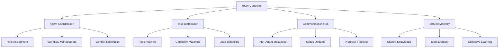

# Team Collaboration System

Buddy AI's team system enables multiple agents to work together collaboratively, sharing knowledge, coordinating tasks, and combining their unique capabilities to solve complex problems.

## 🤝 Team Overview

The team collaboration system provides:

- **Agent Coordination**: Orchestrate multiple agents working toward common goals
- **Task Distribution**: Intelligently distribute work across team members
- **Knowledge Sharing**: Enable agents to share insights and learned information
- **Specialization**: Create agents with specific expertise and capabilities
- **Collective Intelligence**: Leverage diverse agent capabilities for better outcomes



## 🚀 Quick Start

### Basic Team Setup
```python
from buddy import Agent
from buddy.models.openai import OpenAIChat
from buddy.team import AgentTeam, TeamController

# Create specialized agents
researcher = Agent(
    name="Researcher",
    model=OpenAIChat(),
    role="research_specialist",
    instructions="You excel at finding and analyzing information from various sources.",
    tools=["web_search", "arxiv_search", "document_analysis"]
)

writer = Agent(
    name="Writer", 
    model=OpenAIChat(),
    role="content_creator",
    instructions="You create clear, engaging written content.",
    tools=["document_writer", "grammar_checker", "style_analyzer"]
)

analyst = Agent(
    name="Analyst",
    model=OpenAIChat(), 
    role="data_analyst",
    instructions="You analyze data and provide insights.",
    tools=["data_processor", "chart_generator", "statistical_analyzer"]
)

# Create team
team = AgentTeam(
    name="Content Creation Team",
    agents=[researcher, writer, analyst],
    controller=TeamController(
        coordination_strategy="hierarchical",  # or "democratic", "specialized"
        communication_protocol="structured"   # or "free_form", "broadcast"
    )
)

# Use team to complete complex task
result = team.collaborate(
    task="Create a comprehensive report on renewable energy trends",
    requirements={
        "research_depth": "comprehensive",
        "writing_style": "professional", 
        "include_analysis": True,
        "format": "markdown"
    }
)

print(f"Team result: {result.content}")
print(f"Contributors: {[agent.name for agent in result.contributors]}")
```

### Team with Coordination
```python
from buddy.team.coordination import TeamCoordinator

# Advanced team coordination
coordinator = TeamCoordinator(
    coordination_patterns=[
        "sequential_pipeline",  # Tasks flow sequentially
        "parallel_processing",  # Tasks execute in parallel
        "recursive_refinement", # Iterative improvement
        "democratic_consensus", # Team voting on decisions
        "expert_delegation"     # Route to most qualified agent
    ],
    
    # Team dynamics
    communication_rules={
        "max_discussion_rounds": 5,
        "consensus_threshold": 0.7,
        "timeout_per_round": "2_minutes"
    },
    
    # Quality control
    quality_gates={
        "peer_review": True,
        "cross_validation": True,
        "consistency_check": True
    }
)

team.set_coordinator(coordinator)
```

## 🎭 Agent Roles and Specialization

### Role Definition
```python
from buddy.team.roles import AgentRole

# Define specialized roles
class ResearchRole(AgentRole):
    name = "researcher"
    capabilities = [
        "information_gathering",
        "source_verification",
        "data_extraction",
        "fact_checking",
        "trend_analysis"
    ]
    
    tools = [
        "web_search", "academic_search", "news_aggregator",
        "document_reader", "data_scraper"
    ]
    
    personality_traits = {
        "curiosity": 0.9,
        "attention_to_detail": 0.8,
        "skepticism": 0.7  # Questions sources
    }
    
    def evaluate_task_fit(self, task):
        \"\"\"Assess how well this role fits the task.\"\"\"
        research_keywords = ["research", "find", "analyze", "investigate", "study"]
        return sum(1 for keyword in research_keywords if keyword in task.lower())

class WriterRole(AgentRole):
    name = "writer"
    capabilities = [
        "content_creation",
        "editing_proofreading",
        "style_adaptation", 
        "narrative_structure",
        "audience_targeting"
    ]
    
    tools = [
        "document_writer", "grammar_checker", "style_analyzer",
        "plagiarism_detector", "readability_analyzer"
    ]
    
    personality_traits = {
        "creativity": 0.8,
        "empathy": 0.7,     # Understanding audience
        "perfectionism": 0.6 # Attention to quality
    }

# Apply roles to agents
researcher.assign_role(ResearchRole())
writer.assign_role(WriterRole())
```

### Dynamic Role Assignment
```python
from buddy.team.roles import RoleAssigner

role_assigner = RoleAssigner(
    assignment_strategies=[
        "capability_matching",   # Match agent capabilities to task requirements
        "workload_balancing",   # Distribute work evenly
        "expertise_optimization", # Use most expert agent
        "collaborative_benefit"  # Consider team synergy
    ],
    
    # Role flexibility
    allow_role_switching=True,
    multi_role_agents=True,
    role_learning=True  # Agents can learn new roles
)

# Automatically assign roles based on task
task = "Create a technical documentation for our API"
role_assignments = role_assigner.assign_roles(
    task=task,
    available_agents=team.agents,
    task_requirements=["technical_writing", "api_knowledge", "documentation"]
)

print("Role assignments:")
for agent, role in role_assignments.items():
    print(f"  {agent.name}: {role}")
```

## 🔄 Coordination Strategies

### Sequential Pipeline
```python
from buddy.team.coordination import SequentialPipeline

# Tasks flow from one agent to the next
pipeline = SequentialPipeline(
    stages=[
        {"agent": "researcher", "task": "gather information"},
        {"agent": "analyst", "task": "analyze data"},
        {"agent": "writer", "task": "create content"}
    ],
    
    # Pipeline configuration
    stage_dependencies=True,      # Next stage waits for previous
    allow_stage_revision=True,    # Stages can request revisions
    quality_checkpoints=True,     # Quality gates between stages
    
    # Error handling
    retry_failed_stages=True,
    max_retries_per_stage=2,
    fallback_strategies=["skip_stage", "alternative_agent"]
)

team.set_coordination_strategy(pipeline)
```

### Parallel Processing
```python
from buddy.team.coordination import ParallelProcessing

# Multiple agents work simultaneously
parallel_processor = ParallelProcessing(
    task_distribution_strategy="capability_based",  # or "random", "round_robin"
    
    # Synchronization
    synchronization_points=[
        "after_research_phase",
        "before_final_synthesis"
    ],
    
    # Result merging
    result_merging_strategy="weighted_consensus",  # or "voting", "expert_selection"
    conflict_resolution="discussion_based",        # or "authority_based", "majority_vote"
    
    # Performance optimization
    load_balancing=True,
    dynamic_task_redistribution=True
)

# Execute parallel tasks
parallel_result = parallel_processor.execute_parallel_tasks(
    main_task="Analyze market trends",
    subtasks=[
        "Research competitor analysis",
        "Analyze financial data", 
        "Study consumer behavior",
        "Review industry reports"
    ],
    agents=team.agents
)
```

### Democratic Consensus
```python
from buddy.team.coordination import DemocraticConsensus

# Team makes decisions collectively
consensus_coordinator = DemocraticConsensus(
    voting_mechanisms=[
        "simple_majority",      # >50% agreement
        "supermajority",       # >67% agreement
        "unanimous_consent",   # 100% agreement
        "weighted_voting"      # Votes weighted by expertise
    ],
    
    # Discussion process
    discussion_phases=[
        "initial_proposals",    # Each agent proposes approach
        "open_discussion",     # Free-form discussion
        "refinement",          # Proposal refinement
        "final_voting"         # Decision vote
    ],
    
    # Consensus building
    compromise_seeking=True,
    opinion_weighting_by_expertise=True,
    minority_opinion_preservation=True
)

# Make team decision
decision = consensus_coordinator.reach_consensus(
    question="What should be the main focus of our analysis?",
    options=[
        "Focus on cost-benefit analysis",
        "Emphasize environmental impact",
        "Highlight technological innovation",
        "Balance all three aspects"
    ],
    team=team
)

print(f"Team decision: {decision['chosen_option']}")
print(f"Consensus level: {decision['consensus_percentage']:.1%}")
```

## 💬 Team Communication

### Communication Protocols
```python
from buddy.team.communication import CommunicationProtocol

# Structured team communication
protocol = CommunicationProtocol(
    message_types=[
        "task_assignment",      # Assigning work to agents
        "progress_update",      # Status reports
        "information_sharing",  # Knowledge exchange
        "assistance_request",   # Asking for help
        "quality_feedback",     # Peer review comments
        "decision_proposal",    # Suggesting decisions
        "conflict_notification" # Reporting issues
    ],
    
    # Communication rules
    message_routing={
        "broadcast": ["decision_proposal", "progress_update"],
        "targeted": ["task_assignment", "assistance_request"],
        "hierarchical": ["quality_feedback", "conflict_notification"]
    },
    
    # Message formatting
    structured_format=True,
    include_metadata=True,
    message_threading=True  # Group related messages
)

team.set_communication_protocol(protocol)
```

### Information Sharing
```python
from buddy.team.communication import InformationHub

# Central hub for team knowledge sharing
info_hub = InformationHub(
    knowledge_categories=[
        "task_insights",        # Learnings from task execution
        "domain_knowledge",     # Subject matter expertise
        "process_improvements", # Better ways of working
        "external_information", # Information from outside sources
        "team_decisions"        # Decisions made by the team
    ],
    
    # Sharing mechanisms
    automatic_sharing=True,     # Share relevant info automatically
    request_based_sharing=True, # Share when asked
    proactive_sharing=True,     # Anticipate information needs
    
    # Knowledge organization
    tagging_system=True,
    relevance_scoring=True,
    access_permissions=True
)

# Share information
researcher.share_information(
    content="Found key research paper on renewable energy efficiency",
    category="domain_knowledge",
    relevance_tags=["renewable_energy", "efficiency", "research"],
    target_agents=["analyst", "writer"]
)

# Request information
writer.request_information(
    query="Need statistics on solar panel adoption rates",
    urgency="high",
    context="Writing introduction section"
)
```

### Progress Tracking
```python
from buddy.team.communication import ProgressTracker

# Track team progress on tasks
progress_tracker = ProgressTracker(
    tracking_granularity="subtask",  # or "task", "milestone"
    
    # Progress metrics
    metrics=[
        "completion_percentage",
        "time_elapsed",
        "quality_score",
        "resource_utilization",
        "blockers_encountered"
    ],
    
    # Reporting
    auto_status_updates=True,
    update_frequency="30_minutes",
    escalation_triggers={
        "behind_schedule": "20_percent",
        "quality_issues": "score_below_0.7",
        "resource_constraints": "utilization_above_0.9"
    }
)

# Monitor progress
current_progress = progress_tracker.get_team_progress()
print(f"Overall completion: {current_progress['overall_completion']:.1%}")
print(f"Estimated completion: {current_progress['estimated_completion_time']}")

for agent_name, agent_progress in current_progress['by_agent'].items():
    print(f"  {agent_name}: {agent_progress['completion']:.1%}")
```

## 🧠 Shared Memory and Learning

### Team Memory
```python
from buddy.team.memory import SharedMemory

# Memory shared across all team members
shared_memory = SharedMemory(
    memory_types=[
        "collective_knowledge",  # Knowledge accessible to all
        "team_decisions",       # Decisions made collectively
        "shared_experiences",   # Common experiences/learnings
        "best_practices",       # Proven successful approaches
        "team_culture"         # Shared norms and values
    ],
    
    # Access control
    read_permissions="all_agents",
    write_permissions="authorized_agents",
    
    # Memory synchronization
    sync_strategy="eventual_consistency",
    conflict_resolution="timestamp_based",
    
    # Knowledge organization
    knowledge_graph=True,  # Organize as connected concepts
    semantic_indexing=True # Enable semantic search
)

team.set_shared_memory(shared_memory)
```

### Collective Learning
```python
from buddy.team.learning import CollectiveLearning

# Team learns together from experiences
collective_learning = CollectiveLearning(
    learning_mechanisms=[
        "experience_sharing",    # Share what worked/didn't work
        "pattern_recognition",   # Identify successful patterns
        "skill_transfer",       # Transfer skills between agents
        "collaborative_reflection", # Team retrospectives
        "cross_training"        # Learn each other's capabilities
    ],
    
    # Learning optimization
    learning_consolidation=True,  # Consolidate individual learnings
    knowledge_validation=True,    # Validate learned knowledge
    adaptive_specialization=True, # Agents adapt specializations
    
    # Learning metrics
    track_learning_velocity=True,
    measure_knowledge_retention=True,
    assess_skill_development=True
)

# Learn from team experience
collective_learning.process_team_experience(
    experience_type="successful_collaboration",
    context={
        "task_type": "research_report",
        "team_composition": ["researcher", "analyst", "writer"],
        "coordination_strategy": "sequential_pipeline",
        "outcome": "high_quality_result",
        "efficiency": 0.85
    },
    lessons_learned=[
        "Sequential pipeline works well for research reports",
        "Researcher-analyst handoff needs more structure",
        "Writer benefits from early involvement in planning"
    ]
)
```

### Knowledge Synthesis
```python
from buddy.team.knowledge import KnowledgeSynthesizer

# Combine knowledge from multiple agents
synthesizer = KnowledgeSynthesizer(
    synthesis_methods=[
        "consensus_building",    # Find common ground
        "perspective_integration", # Combine different viewpoints
        "evidence_aggregation",   # Combine supporting evidence
        "conflict_resolution",    # Resolve contradictions
        "knowledge_expansion"     # Build on existing knowledge
    ],
    
    # Quality control
    credibility_weighting=True,   # Weight by source credibility
    consistency_checking=True,    # Check for contradictions
    completeness_assessment=True, # Identify gaps
    
    # Output formatting
    structured_output=True,
    source_attribution=True,
    confidence_scoring=True
)

# Synthesize team knowledge
synthesis = synthesizer.synthesize_knowledge(
    topic="renewable energy market trends",
    sources=[
        {"agent": "researcher", "knowledge": researcher.get_knowledge("renewable_energy")},
        {"agent": "analyst", "knowledge": analyst.get_knowledge("market_data")},
        {"agent": "writer", "knowledge": writer.get_knowledge("industry_reports")}
    ]
)

print("Synthesized knowledge:")
print(f"Content: {synthesis['content']}")
print(f"Confidence: {synthesis['confidence_score']:.2f}")
print(f"Sources: {synthesis['source_agents']}")
```

## ⚖️ Conflict Resolution

### Conflict Detection
```python
from buddy.team.conflict import ConflictDetector

# Detect conflicts in team interactions
conflict_detector = ConflictDetector(
    conflict_types=[
        "information_disagreement",  # Contradictory information
        "approach_conflict",        # Different methods preferred
        "priority_mismatch",        # Different task priorities
        "resource_contention",      # Competition for resources
        "quality_standards",        # Different quality expectations
        "communication_breakdown"   # Misunderstandings
    ],
    
    detection_methods=[
        "semantic_analysis",        # Analyze message content
        "sentiment_analysis",       # Detect negative sentiment
        "pattern_recognition",      # Identify conflict patterns
        "explicit_reporting"        # Agents report conflicts
    ],
    
    # Early warning system
    escalation_thresholds={
        "disagreement_frequency": 3,  # 3 disagreements in short time
        "negative_sentiment": 0.7,    # Strongly negative sentiment
        "communication_drops": 0.5    # 50% reduction in communication
    }
)

team.add_conflict_detector(conflict_detector)
```

### Conflict Resolution Strategies
```python
from buddy.team.conflict import ConflictResolver

# Resolve team conflicts
conflict_resolver = ConflictResolver(
    resolution_strategies=[
        "mediation",               # Neutral party mediation
        "fact_based_resolution",   # Resolve using facts/evidence
        "compromise_seeking",      # Find middle ground
        "expert_arbitration",      # Defer to subject matter expert
        "democratic_voting",       # Team vote on resolution
        "escalation_to_human"      # Human intervention
    ],
    
    # Resolution process
    cooling_off_period="5_minutes",  # Brief pause before resolution
    structured_discussion=True,      # Organized discussion format
    solution_evaluation=True,        # Evaluate proposed solutions
    
    # Follow-up
    resolution_tracking=True,        # Track resolution effectiveness
    relationship_repair=True,        # Repair agent relationships
    learning_integration=True        # Learn from conflicts
)

# Handle detected conflict
conflict_situation = {
    "type": "approach_conflict",
    "agents": ["researcher", "analyst"],
    "issue": "Disagreement on data collection methodology",
    "context": "Market analysis task"
}

resolution = conflict_resolver.resolve_conflict(conflict_situation)
print(f"Resolution strategy: {resolution['strategy']}")
print(f"Agreed solution: {resolution['solution']}")
print(f"Agent agreement: {resolution['agent_agreement']}")
```

## 📊 Team Performance Analytics

### Team Metrics
```python
from buddy.team.analytics import TeamAnalytics

# Comprehensive team performance analysis
team_analytics = TeamAnalytics(
    performance_metrics=[
        "task_completion_rate",
        "collaboration_efficiency",
        "knowledge_sharing_rate",
        "conflict_resolution_time",
        "collective_learning_speed",
        "output_quality_scores",
        "team_satisfaction"
    ],
    
    # Analysis dimensions
    analysis_dimensions=[
        "by_agent",           # Individual agent performance
        "by_role",           # Performance by role type
        "by_task_type",      # Performance by task category
        "by_team_composition", # Performance by team makeup
        "by_coordination_strategy" # Performance by coordination
    ],
    
    # Benchmarking
    benchmark_comparison=True,
    historical_trending=True,
    peer_team_comparison=True
)

# Generate team performance report
performance_report = team_analytics.generate_performance_report()
print("Team Performance Summary:")
print(f"  Overall efficiency: {performance_report['efficiency_score']:.2f}")
print(f"  Collaboration quality: {performance_report['collaboration_score']:.2f}")
print(f"  Knowledge utilization: {performance_report['knowledge_score']:.2f}")

# Individual agent contributions
print("\\nAgent Contributions:")
for agent, metrics in performance_report['agent_metrics'].items():
    print(f"  {agent}:")
    print(f"    Task completion: {metrics['completion_rate']:.1%}")
    print(f"    Quality output: {metrics['quality_score']:.2f}")
    print(f"    Team collaboration: {metrics['collaboration_score']:.2f}")
```

### Optimization Recommendations
```python
from buddy.team.optimization import TeamOptimizer

# AI-powered team optimization
team_optimizer = TeamOptimizer(
    optimization_targets=[
        "maximize_efficiency",
        "improve_quality",
        "enhance_collaboration",
        "reduce_conflicts",
        "accelerate_learning"
    ],
    
    # Optimization strategies
    strategies=[
        "team_composition_adjustment",  # Change team members
        "role_rebalancing",            # Adjust role assignments
        "process_improvement",         # Improve workflows
        "communication_enhancement",   # Better communication
        "skill_development",          # Develop missing skills
        "tool_optimization"           # Better tool usage
    ]
)

# Get optimization recommendations
recommendations = team_optimizer.analyze_and_recommend(team)
print("Team Optimization Recommendations:")
for category, suggestions in recommendations.items():
    print(f"\\n{category}:")
    for suggestion in suggestions:
        print(f"  - {suggestion['description']}")
        print(f"    Expected impact: {suggestion['expected_impact']}")
        print(f"    Implementation effort: {suggestion['effort_level']}")
```

## 🎯 Advanced Team Features

### Hierarchical Teams
```python
from buddy.team.hierarchy import HierarchicalTeam

# Multi-level team structure
hierarchical_team = HierarchicalTeam(
    structure={
        "team_lead": {
            "agent": "senior_researcher",
            "responsibilities": ["task_planning", "quality_oversight", "decision_making"],
            "authority_level": "high"
        },
        "specialists": [
            {"agent": "researcher", "specialty": "data_gathering"},
            {"agent": "analyst", "specialty": "data_analysis"}, 
            {"agent": "writer", "specialty": "content_creation"}
        ],
        "support": [
            {"agent": "assistant", "role": "coordination_support"}
        ]
    },
    
    # Hierarchy rules
    delegation_rules={
        "task_assignment": "top_down",
        "progress_reporting": "bottom_up",
        "decision_escalation": "hierarchical",
        "knowledge_sharing": "all_directions"
    }
)
```

### Dynamic Team Scaling
```python
from buddy.team.scaling import DynamicScaling

# Automatically scale team size based on workload
dynamic_scaling = DynamicScaling(
    scaling_triggers={
        "workload_threshold": 0.8,      # Scale up at 80% capacity
        "response_time_degradation": "20_percent", # Scale up if 20% slower
        "quality_decline": 0.1,         # Scale up if quality drops 10%
        "idle_capacity": 0.3            # Scale down at 30% idle
    },
    
    # Scaling strategies
    scale_up_strategies=[
        "add_specialist_agents",        # Add agents with specific skills
        "clone_existing_agents",       # Duplicate successful agents
        "recruit_from_pool",           # Get agents from shared pool
        "request_human_assistance"     # Escalate to humans
    ],
    
    scale_down_strategies=[
        "reassign_agents",             # Move agents to other teams
        "merge_similar_roles",         # Combine similar capabilities
        "park_idle_agents"             # Put unused agents on standby
    ]
)

team.enable_dynamic_scaling(dynamic_scaling)
```

## 🏆 Best Practices

### Team Design Guidelines
1. **Clear Role Definition**: Define clear, non-overlapping agent roles
2. **Complementary Skills**: Combine agents with complementary capabilities
3. **Effective Communication**: Establish clear communication protocols
4. **Conflict Prevention**: Design processes to minimize conflicts
5. **Continuous Learning**: Enable team learning and adaptation

### Performance Optimization
1. **Right-size Teams**: Use optimal number of agents for task complexity
2. **Balance Specialization**: Mix specialists and generalists appropriately
3. **Streamline Coordination**: Minimize coordination overhead
4. **Leverage Strengths**: Assign tasks to agents' strongest capabilities
5. **Monitor and Adjust**: Continuously monitor and optimize team performance

The team collaboration system transforms individual Buddy AI agents into powerful collective intelligence systems capable of tackling complex, multi-faceted challenges that would be difficult for any single agent to handle alone.