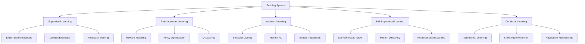

# Agent Training System

Buddy AI's training system enables agents to learn from experience, improve their performance over time, and adapt to specific domains and user preferences through various learning mechanisms.

## 🎯 Training Overview

The training system provides multiple learning approaches:

- **Supervised Learning**: Learn from labeled examples and expert demonstrations
- **Reinforcement Learning**: Learn through trial and error with reward feedback
- **Imitation Learning**: Learn by observing and mimicking expert behavior
- **Self-Supervised Learning**: Learn from unlabeled data and self-generated tasks
- **Continual Learning**: Continuously adapt and improve without forgetting



## 🚀 Quick Start

### Basic Training Setup
```python
from buddy import Agent
from buddy.models.openai import OpenAIChat
from buddy.train import TrainingManager, SupervisedTrainer

# Create agent for training
agent = Agent(
    model=OpenAIChat(),
    name="TrainableAgent",
    learning_enabled=True
)

# Create training manager
training_manager = TrainingManager(
    agent=agent,
    training_methods=["supervised", "reinforcement", "imitation"],
    
    # Training configuration
    training_config={
        "batch_size": 32,
        "learning_rate": 0.001,
        "max_epochs": 100,
        "validation_split": 0.2,
        "early_stopping": True
    }
)

# Create supervised trainer
supervised_trainer = SupervisedTrainer(
    training_data_path="./training_data/conversations.json",
    validation_data_path="./training_data/validation.json",
    
    # Training objectives
    objectives=[
        "response_quality",
        "task_completion", 
        "user_satisfaction",
        "factual_accuracy"
    ]
)

# Start training
training_results = training_manager.train(
    trainer=supervised_trainer,
    training_duration="2_hours",
    save_checkpoints=True,
    monitor_performance=True
)

print(f"Training completed. Final performance: {training_results['final_score']:.3f}")
```

### Online Learning
```python
from buddy.train.online import OnlineLearner

# Enable online learning from interactions
online_learner = OnlineLearner(
    learning_triggers=[
        "user_feedback",      # Learn from explicit feedback
        "task_completion",    # Learn from successful task completion
        "error_correction",   # Learn from mistakes
        "preference_signals"  # Learn from user behavior
    ],
    
    # Learning parameters
    adaptation_rate=0.1,      # How quickly to adapt
    confidence_threshold=0.8, # Minimum confidence for learning
    batch_learning=True,      # Accumulate before updating
    
    # Safety measures
    catastrophic_forgetting_protection=True,
    quality_degradation_monitoring=True,
    rollback_on_performance_drop=True
)

agent.enable_online_learning(online_learner)

# Agent learns from each interaction
response = agent.run("Help me write a professional email")
# User provides feedback: "Great response, but could be more concise"

online_learner.process_feedback(
    interaction_id=response.id,
    feedback={
        "rating": 4.0,
        "suggestions": ["more_concise"],
        "positive_aspects": ["professional_tone", "helpful_structure"]
    }
)
# Agent learns to be more concise in future email writing tasks
```

## 📚 Supervised Learning

### Expert Demonstrations
```python
from buddy.train.supervised import ExpertDemonstrationTrainer

# Learn from expert examples
expert_trainer = ExpertDemonstrationTrainer(
    expert_data_sources=[
        "human_expert_conversations",
        "curated_high_quality_responses",
        "domain_expert_annotations"
    ],
    
    # Training configuration
    demonstration_format="conversation_pairs",
    quality_filtering=True,
    diversity_sampling=True,
    
    # Learning objectives
    learning_targets=[
        "response_appropriateness",
        "knowledge_accuracy",
        "communication_style",
        "problem_solving_approach"
    ]
)

# Prepare training data
training_examples = expert_trainer.prepare_training_data([
    {
        "input": "How do I optimize database queries?",
        "expert_response": "To optimize database queries, start with indexing frequently queried columns...",
        "quality_score": 0.95,
        "expert_id": "database_expert_1"
    },
    {
        "input": "Explain machine learning in simple terms",
        "expert_response": "Machine learning is like teaching a computer to recognize patterns...",
        "quality_score": 0.90,
        "expert_id": "ai_expert_2"
    }
])

# Train on expert demonstrations
training_results = expert_trainer.train(
    examples=training_examples,
    validation_strategy="cross_validation",
    evaluation_metrics=["response_quality", "knowledge_accuracy"]
)
```

### Feedback-based Training
```python
from buddy.train.supervised import FeedbackTrainer

# Learn from user feedback
feedback_trainer = FeedbackTrainer(
    feedback_types=[
        "explicit_ratings",     # Direct numerical ratings
        "preference_rankings",  # Comparative preferences
        "correction_feedback",  # Direct corrections
        "implicit_signals"     # Behavioral indicators
    ],
    
    # Feedback processing
    feedback_aggregation="weighted_average",
    credibility_weighting=True,  # Weight feedback by user credibility
    temporal_weighting=True,     # Recent feedback weighted more
    
    # Learning adaptation
    adaptive_learning_rate=True,  # Adjust based on feedback consistency
    personalization_enabled=True, # Learn individual preferences
    domain_specialization=True   # Learn domain-specific patterns
)

# Process feedback data
feedback_data = [
    {
        "interaction_id": "int_001",
        "user_rating": 4.5,
        "feedback_text": "Very helpful and accurate",
        "user_expertise": "intermediate",
        "timestamp": "2024-01-15T10:00:00Z"
    },
    {
        "interaction_id": "int_002", 
        "user_rating": 2.5,
        "feedback_text": "Too technical, need simpler explanation",
        "user_expertise": "beginner",
        "timestamp": "2024-01-15T10:05:00Z"
    }
]

feedback_trainer.process_feedback_batch(feedback_data)
```

### Task-specific Fine-tuning
```python
from buddy.train.supervised import TaskSpecificTrainer

# Fine-tune for specific domains or tasks
task_trainer = TaskSpecificTrainer(
    target_domains=[
        "customer_service",
        "technical_support",
        "creative_writing",
        "data_analysis",
        "educational_tutoring"
    ],
    
    # Domain adaptation
    domain_specific_datasets=True,
    transfer_learning=True,      # Use knowledge from other domains
    domain_vocabulary_expansion=True,
    
    # Specialization strategies
    multi_task_learning=True,    # Learn multiple related tasks
    curriculum_learning=True,    # Progressive difficulty
    meta_learning=True          # Learn how to learn new tasks
)

# Fine-tune for customer service
customer_service_data = task_trainer.load_domain_data("customer_service")
fine_tuning_results = task_trainer.fine_tune(
    domain="customer_service",
    training_data=customer_service_data,
    specialization_level="high",  # Deep specialization
    preserve_general_ability=True # Don't forget general knowledge
)
```

## 🎮 Reinforcement Learning

### Reward Modeling
```python
from buddy.train.reinforcement import RewardModel

# Define reward signals for learning
reward_model = RewardModel(
    reward_components=[
        {
            "name": "task_completion",
            "weight": 0.4,
            "calculation": "binary_success"  # 1 if successful, 0 if not
        },
        {
            "name": "user_satisfaction", 
            "weight": 0.3,
            "calculation": "rating_normalized"  # Normalize 1-5 rating to 0-1
        },
        {
            "name": "efficiency",
            "weight": 0.2,
            "calculation": "inverse_time"  # Reward faster completion
        },
        {
            "name": "accuracy",
            "weight": 0.1,
            "calculation": "fact_check_score"  # Factual accuracy score
        }
    ],
    
    # Reward shaping
    temporal_discounting=0.95,    # Discount future rewards
    sparse_reward_handling=True,  # Handle infrequent rewards
    reward_normalization=True,    # Normalize reward values
    
    # Safety measures
    reward_hacking_prevention=True,
    adversarial_reward_detection=True
)

agent.set_reward_model(reward_model)
```

### Policy Optimization
```python
from buddy.train.reinforcement import PolicyOptimizer

# Optimize agent behavior policy
policy_optimizer = PolicyOptimizer(
    optimization_algorithm="PPO",  # Proximal Policy Optimization
    
    # Training hyperparameters
    learning_rate=3e-4,
    batch_size=64,
    n_epochs=10,
    clip_range=0.2,
    
    # Exploration strategy
    exploration_method="epsilon_greedy",
    epsilon_start=0.5,
    epsilon_end=0.1,
    epsilon_decay=0.995,
    
    # Policy constraints
    action_space_constraints=True,
    safety_constraints=True,
    performance_lower_bounds=True
)

# Train with reinforcement learning
rl_trainer = ReinforcementLearningTrainer(
    environment=agent.get_environment(),
    policy_optimizer=policy_optimizer,
    reward_model=reward_model
)

training_progress = rl_trainer.train(
    num_episodes=1000,
    max_steps_per_episode=100,
    evaluation_frequency=50  # Evaluate every 50 episodes
)

print("RL Training Progress:")
for episode in range(0, 1000, 100):
    avg_reward = training_progress[episode]['average_reward']
    print(f"Episode {episode}: Average Reward = {avg_reward:.3f}")
```

### Q-Learning for Decision Making
```python
from buddy.train.reinforcement import QLearningTrainer

# Learn optimal decision-making policies
q_learner = QLearningTrainer(
    state_representation="text_embedding",  # How to represent states
    action_space=[
        "ask_clarifying_question",
        "provide_direct_answer", 
        "search_for_information",
        "escalate_to_human",
        "request_additional_context"
    ],
    
    # Q-learning parameters
    learning_rate=0.1,
    discount_factor=0.95,
    exploration_rate=0.1,
    
    # Advanced features
    experience_replay=True,      # Learn from past experiences
    double_q_learning=True,      # Reduce overestimation bias
    prioritized_replay=True,     # Focus on important experiences
    
    # Function approximation
    neural_network_approximation=True,
    network_architecture="transformer"
)

# Train Q-learning agent
q_learning_results = q_learner.train(
    training_environment=agent.get_environment(),
    num_training_steps=10000,
    evaluation_frequency=500,
    save_best_policy=True
)
```

## 🎭 Imitation Learning

### Behavior Cloning
```python
from buddy.train.imitation import BehaviorCloning

# Learn by mimicking expert behavior
behavior_cloner = BehaviorCloning(
    expert_trajectory_sources=[
        "human_expert_interactions",
        "high_performing_agent_logs",
        "curated_demonstration_dataset"
    ],
    
    # Cloning strategy
    cloning_method="supervised_sequence_learning",
    state_action_matching=True,
    trajectory_optimization=True,
    
    # Data augmentation
    trajectory_augmentation=True,
    noise_injection=0.05,        # Add small amount of noise
    synthetic_trajectory_generation=True,
    
    # Regularization
    l2_regularization=0.01,
    dropout_rate=0.1,
    early_stopping_patience=10
)

# Load expert demonstrations
expert_trajectories = behavior_cloner.load_expert_data([
    {
        "trajectory_id": "expert_001",
        "states": ["user_question", "information_gathering", "response_generation"],
        "actions": ["analyze_query", "search_knowledge", "synthesize_answer"],
        "outcomes": ["successful_resolution"],
        "quality_score": 0.95
    }
])

# Train behavior cloning model
bc_results = behavior_cloner.train(
    expert_trajectories=expert_trajectories,
    validation_split=0.2,
    imitation_accuracy_threshold=0.85
)
```

### Inverse Reinforcement Learning
```python
from buddy.train.imitation import InverseReinforcementLearning

# Learn reward function from expert behavior
irl_trainer = InverseReinforcementLearning(
    expert_demonstrations=expert_trajectories,
    
    # IRL algorithm
    algorithm="MaxEnt",  # Maximum Entropy IRL
    
    # Reward function learning
    reward_function_class="neural_network",
    feature_extraction="transformer_embeddings",
    
    # Optimization
    gradient_steps=1000,
    learning_rate=0.001,
    regularization_weight=0.1,
    
    # Validation
    cross_validation_folds=5,
    expert_policy_comparison=True
)

# Learn implicit reward function
learned_reward_function = irl_trainer.learn_rewards(
    environment=agent.get_environment(),
    expert_demonstrations=expert_trajectories
)

# Apply learned rewards to RL training
agent.set_reward_function(learned_reward_function)
```

## 🔄 Continual Learning

### Incremental Learning
```python
from buddy.train.continual import IncrementalLearner

# Learn new tasks without forgetting old ones
incremental_learner = IncrementalLearner(
    learning_strategies=[
        "elastic_weight_consolidation",  # Protect important weights
        "progressive_neural_networks",   # Add new capacity
        "memory_replay",                # Replay old examples
        "knowledge_distillation",       # Transfer knowledge
        "meta_learning_adaptation"      # Learn how to adapt
    ],
    
    # Catastrophic forgetting prevention
    forgetting_protection_strength=0.8,
    memory_buffer_size=1000,
    rehearsal_frequency=0.1,  # 10% of training on old tasks
    
    # Task boundary detection
    automatic_task_detection=True,
    task_similarity_threshold=0.7,
    new_task_adaptation_speed=0.05
)

agent.enable_continual_learning(incremental_learner)

# Learn new domain while preserving existing knowledge
new_domain_data = load_domain_data("medical_assistance")
incremental_learner.learn_new_domain(
    domain_name="medical_assistance",
    training_data=new_domain_data,
    preserve_previous_domains=True,
    adaptation_episodes=500
)
```

### Knowledge Retention
```python
from buddy.train.continual import KnowledgeRetentionManager

# Manage knowledge retention across learning episodes
retention_manager = KnowledgeRetentionManager(
    retention_strategies=[
        "importance_based_retention",   # Keep important knowledge
        "recency_based_retention",     # Keep recent knowledge
        "frequency_based_retention",   # Keep frequently used knowledge
        "semantic_clustering",         # Group related knowledge
        "hierarchical_importance"      # Multi-level importance
    ],
    
    # Memory management
    memory_capacity_limit="10GB",
    compression_algorithms=["gzip", "neural_compression"],
    archival_strategy="hierarchical_storage",
    
    # Knowledge validation
    knowledge_consistency_checking=True,
    outdated_knowledge_detection=True,
    knowledge_update_mechanisms=True
)

agent.set_knowledge_retention_manager(retention_manager)
```

### Adaptive Learning
```python
from buddy.train.continual import AdaptiveLearner

# Adapt learning approach based on performance and context
adaptive_learner = AdaptiveLearner(
    adaptation_dimensions=[
        "learning_rate",        # Adjust learning speed
        "batch_size",          # Adjust training batch size
        "exploration_rate",    # Adjust exploration vs exploitation
        "memory_allocation",   # Adjust memory usage
        "training_frequency",  # Adjust how often to train
        "task_prioritization"  # Adjust task importance weights
    ],
    
    # Adaptation triggers
    adaptation_triggers={
        "performance_plateau": "increase_learning_rate",
        "rapid_improvement": "maintain_current_settings", 
        "performance_decline": "reduce_learning_rate",
        "new_task_type": "increase_exploration",
        "resource_constraints": "reduce_batch_size"
    },
    
    # Meta-learning
    meta_learning_enabled=True,
    learn_to_learn_algorithms=["MAML", "Reptile"],
    few_shot_adaptation=True
)

agent.enable_adaptive_learning(adaptive_learner)
```

## 📊 Training Evaluation

### Performance Metrics
```python
from buddy.train.evaluation import TrainingEvaluator

# Comprehensive training evaluation
evaluator = TrainingEvaluator(
    evaluation_metrics=[
        "task_success_rate",      # Percentage of successful task completions
        "response_quality_score", # Average quality rating
        "learning_efficiency",    # Improvement rate over time
        "knowledge_retention",    # Retention of learned information
        "adaptation_speed",       # Speed of adapting to new tasks
        "generalization_ability", # Performance on unseen tasks
        "stability_measure"       # Consistency of performance
    ],
    
    # Evaluation protocols
    evaluation_strategies=[
        "held_out_test_set",     # Standard test set evaluation
        "cross_validation",      # K-fold cross validation
        "temporal_validation",   # Test on future data
        "domain_transfer",       # Test on different domains
        "few_shot_evaluation",   # Test with limited examples
        "adversarial_testing"    # Test robustness
    ],
    
    # Benchmarking
    baseline_comparisons=True,
    human_expert_comparison=True,
    state_of_art_comparison=True
)

# Evaluate training progress
evaluation_results = evaluator.evaluate_training_progress(
    agent=agent,
    evaluation_data=validation_dataset,
    evaluation_frequency="every_epoch",
    detailed_analysis=True
)

print("Training Evaluation Results:")
print(f"Overall Performance Score: {evaluation_results['overall_score']:.3f}")
print(f"Learning Progress: {evaluation_results['learning_progress']:.2%}")
print(f"Knowledge Retention: {evaluation_results['retention_score']:.3f}")

# Detailed metrics breakdown
for metric, score in evaluation_results['detailed_metrics'].items():
    print(f"  {metric}: {score:.3f}")
```

### A/B Testing for Training
```python
from buddy.train.evaluation import TrainingABTesting

# Test different training approaches
ab_tester = TrainingABTesting(
    test_configurations=[
        {
            "name": "standard_supervised",
            "training_method": "supervised",
            "learning_rate": 0.001,
            "batch_size": 32
        },
        {
            "name": "enhanced_feedback",
            "training_method": "supervised_with_feedback",
            "learning_rate": 0.001,
            "batch_size": 32,
            "feedback_weight": 0.3
        },
        {
            "name": "reinforcement_learning",
            "training_method": "reinforcement",
            "learning_rate": 0.0005,
            "exploration_rate": 0.1
        }
    ],
    
    # Testing protocol
    sample_size_per_group=1000,
    significance_level=0.05,
    statistical_power=0.8,
    
    # Metrics to compare
    comparison_metrics=[
        "final_performance",
        "learning_speed",
        "sample_efficiency",
        "robustness"
    ]
)

# Run A/B test
ab_results = ab_tester.run_training_comparison(
    training_data=training_dataset,
    evaluation_data=test_dataset,
    test_duration="1_week"
)

print("A/B Testing Results:")
for config_name, results in ab_results.items():
    print(f"\\n{config_name}:")
    print(f"  Final Performance: {results['final_performance']:.3f}")
    print(f"  Learning Speed: {results['learning_speed']:.3f}")
    print(f"  Statistical Significance: {results['p_value']:.4f}")
```

## 🛠️ Training Tools and Infrastructure

### Training Data Management
```python
from buddy.train.data import TrainingDataManager

# Comprehensive training data management
data_manager = TrainingDataManager(
    data_sources=[
        "conversation_logs",
        "expert_demonstrations",
        "user_feedback",
        "synthetic_data",
        "external_datasets"
    ],
    
    # Data processing
    preprocessing_pipeline=[
        "data_cleaning",
        "quality_filtering",
        "deduplication",
        "anonymization",
        "augmentation"
    ],
    
    # Data versioning
    version_control=True,
    data_lineage_tracking=True,
    reproducibility_guarantees=True,
    
    # Quality assurance
    automatic_quality_checking=True,
    bias_detection=True,
    data_validation=True
)

# Prepare training dataset
training_dataset = data_manager.prepare_dataset(
    data_sources=["conversation_logs", "expert_demonstrations"],
    quality_threshold=0.8,
    diversity_sampling=True,
    stratified_splitting=True,
    
    # Dataset splits
    train_split=0.7,
    validation_split=0.15,
    test_split=0.15
)
```

### Training Infrastructure
```python
from buddy.train.infrastructure import TrainingInfrastructure

# Scalable training infrastructure
infrastructure = TrainingInfrastructure(
    compute_resources={
        "cpu_cores": 16,
        "memory_gb": 64,
        "gpu_memory_gb": 24,
        "storage_gb": 1000
    },
    
    # Distributed training
    distributed_training=True,
    num_training_nodes=4,
    synchronization_strategy="parameter_server",
    
    # Optimization
    mixed_precision_training=True,
    gradient_accumulation_steps=4,
    automatic_scaling=True,
    
    # Monitoring
    real_time_monitoring=True,
    tensorboard_logging=True,
    wandb_integration=True,
    custom_metrics_tracking=True
)

# Configure training environment
training_environment = infrastructure.setup_training_environment(
    framework="pytorch",  # or "tensorflow", "jax"
    optimization_level="O2",  # Mixed precision optimization
    checkpointing=True,
    automatic_resume=True
)
```

## 🎯 Advanced Training Techniques

### Meta-Learning
```python
from buddy.train.advanced import MetaLearner

# Learn how to learn new tasks quickly
meta_learner = MetaLearner(
    meta_learning_algorithm="MAML",  # Model-Agnostic Meta-Learning
    
    # Task distribution
    task_family="conversation_assistance",
    task_sampling_strategy="uniform",
    num_support_examples=10,  # Examples for adaptation
    num_query_examples=15,    # Examples for evaluation
    
    # Meta-optimization
    meta_learning_rate=0.001,
    inner_learning_rate=0.01,
    inner_gradient_steps=5,
    
    # Evaluation
    few_shot_evaluation=True,
    zero_shot_evaluation=True,
    cross_domain_evaluation=True
)

# Train meta-learner on task distribution
meta_training_results = meta_learner.meta_train(
    task_distribution=conversation_task_distribution,
    num_meta_iterations=1000,
    tasks_per_iteration=10
)

# Quickly adapt to new task
new_task_examples = load_new_task_data("code_debugging")
adapted_agent = meta_learner.adapt_to_task(
    new_task_examples=new_task_examples,
    adaptation_steps=5
)
```

### Self-Supervised Learning
```python
from buddy.train.advanced import SelfSupervisedLearner

# Learn from unlabeled data
ssl_learner = SelfSupervisedLearner(
    pretext_tasks=[
        "masked_language_modeling",  # Predict masked tokens
        "next_sentence_prediction",  # Predict if sentences follow
        "conversation_coherence",    # Predict conversation flow
        "response_appropriateness",  # Self-assess response quality
        "knowledge_consistency"      # Ensure consistent knowledge
    ],
    
    # Learning objectives
    contrastive_learning=True,
    representation_learning=True,
    consistency_regularization=True,
    
    # Data augmentation
    augmentation_strategies=[
        "paraphrasing",
        "back_translation",
        "noise_injection",
        "context_dropping"
    ]
)

# Pre-train on unlabeled data
unlabeled_data = load_large_corpus("web_conversations")
ssl_results = ssl_learner.pretrain(
    unlabeled_data=unlabeled_data,
    pretraining_epochs=50,
    save_pretrained_model=True
)

# Fine-tune on specific task
fine_tuned_agent = ssl_learner.fine_tune(
    pretrained_model=ssl_results['model'],
    task_specific_data=labeled_training_data,
    fine_tuning_epochs=10
)
```

### Curriculum Learning
```python
from buddy.train.advanced import CurriculumLearner

# Progressive learning from easy to hard examples
curriculum_learner = CurriculumLearner(
    curriculum_strategies=[
        "difficulty_based",      # Easy to hard progression
        "complexity_based",      # Simple to complex tasks
        "diversity_based",       # Gradually increase diversity
        "competency_based"       # Based on current skill level
    ],
    
    # Difficulty assessment
    difficulty_metrics=[
        "task_complexity_score",
        "required_reasoning_depth",
        "knowledge_breadth_needed",
        "interaction_length",
        "ambiguity_level"
    ],
    
    # Progression control
    progression_criteria={
        "performance_threshold": 0.8,  # Move to next level at 80% accuracy
        "consistency_requirement": 10,  # Consistent performance for 10 examples
        "adaptation_speed": "moderate"   # How quickly to progress
    }
)

# Design curriculum
curriculum = curriculum_learner.design_curriculum(
    training_examples=all_training_data,
    num_difficulty_levels=5,
    examples_per_level=1000
)

# Train with curriculum
curriculum_results = curriculum_learner.train_with_curriculum(
    agent=agent,
    curriculum=curriculum,
    adaptive_progression=True  # Adapt progression based on performance
)
```

## 🏆 Best Practices

### Training Strategy Guidelines
1. **Start Simple**: Begin with basic supervised learning before advanced techniques
2. **Data Quality**: Ensure high-quality, diverse training data
3. **Evaluation Rigor**: Use comprehensive evaluation metrics and protocols
4. **Incremental Improvement**: Make incremental improvements rather than radical changes
5. **Safety First**: Implement safety measures and quality controls

### Optimization Tips
1. **Learning Rate Scheduling**: Use adaptive learning rate schedules
2. **Regularization**: Apply appropriate regularization to prevent overfitting
3. **Early Stopping**: Stop training when validation performance plateaus
4. **Checkpointing**: Save model checkpoints for recovery and analysis
5. **Monitoring**: Continuously monitor training progress and metrics

The training system enables Buddy AI agents to continuously improve their performance, adapt to new domains, and provide increasingly effective assistance through sophisticated learning mechanisms.